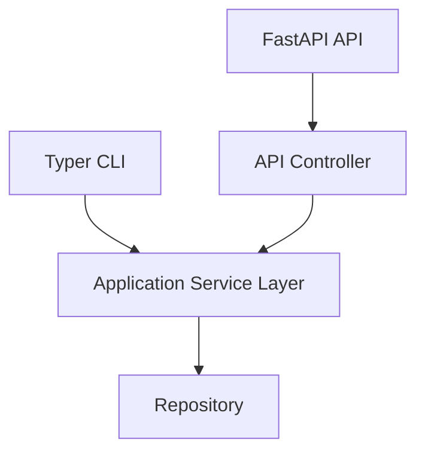
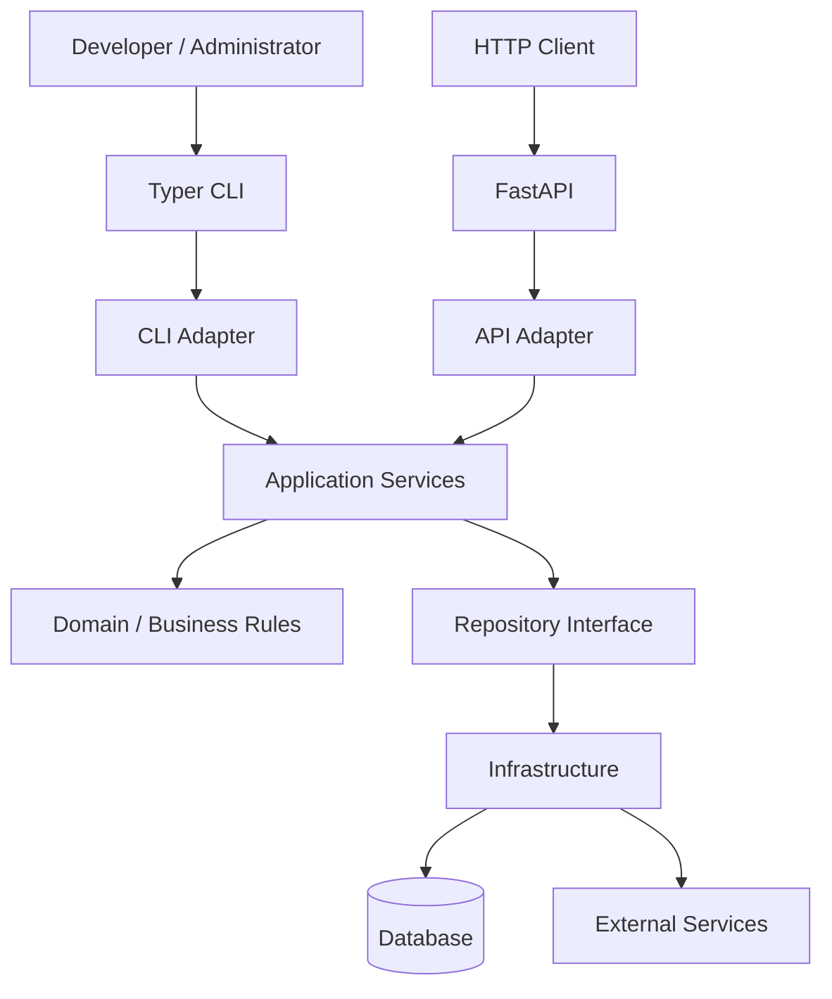

# Implementation Guideline: CLI for Python Web Applications

## 1. Purpose

This guideline defines the recommended approach for adding a **Command-Line Interface (CLI)** to a Python web application.

The selected technology is **Typer**, with the CLI treated as a first-class application entry point alongside the web API.

The primary architectural principle is:

> **The CLI should invoke application services directly, not call the application's HTTP API.**

---

# 2. Recommended Technology

## 2.1 Selected tool: Typer

Use **Typer** as the CLI framework.

Why Typer:

* Built on Python type hints.
* Automatic `--help` generation.
* Automatic argument and option validation.
* Good support for subcommands.
* Integrates naturally with modern Python applications.
* Minimal boilerplate.
* Works well with dependency injection patterns.
* Provides shell completion.
* Easier to maintain than a hand-built `argparse` command dispatcher.

Example:

```python
import typer

app = typer.Typer()


@app.command()
def create_user(name: str, email: str):
    ...


@app.command()
def list_users():
    ...


if __name__ == "__main__":
    app()
```

The resulting interface becomes:

```bash
myapp create-user --help
myapp list-users --help
```

---

# 3. Architectural Principle

The CLI must **not duplicate business logic**.

Avoid:

```text
CLI
 │
 └── HTTP request
       │
       ▼
    FastAPI
       │
       ▼
   Controller
       │
       ▼
    Service
```

This introduces unnecessary overhead and couples the CLI to the HTTP API.

Instead:



Both entry points use the same application services.

```text
             ┌──────────────┐
             │   Typer CLI  │
             └──────┬───────┘
                    │
                    ▼
          ┌──────────────────┐
          │ Application      │
          │ Services         │
          └────────┬─────────┘
                   │
                   ▼
          ┌──────────────────┐
          │ Repository /     │
          │ Infrastructure   │
          └──────────────────┘
                   ▲
                   │
          ┌────────┴─────────┐
          │    FastAPI       │
          │    Controllers   │
          └──────────────────┘
```

---

# 4. Recommended Project Structure

For a typical FastAPI application:

```text
app/
├── api/
│   ├── __init__.py
│   └── users.py
│
├── cli/
│   ├── __init__.py
│   ├── main.py
│   └── users.py
│
├── services/
│   ├── __init__.py
│   └── user_service.py
│
├── repositories/
│   ├── __init__.py
│   └── user_repository.py
│
├── models/
│   └── user.py
│
├── dependencies/
│   └── ...
│
└── main.py
```

Responsibilities:

| Component       | Responsibility                           |
| --------------- | ---------------------------------------- |
| `cli/main.py`   | CLI application and command registration |
| `cli/users.py`  | User-related CLI commands                |
| `api/`          | HTTP/API concerns                        |
| `services/`     | Business/application logic               |
| `repositories/` | Data access                              |
| `models/`       | Domain/data models                       |

---

# 5. CLI Entry Point

Create one root Typer application.

```python
# app/cli/main.py

import typer

from app.cli.users import app as users_app

app = typer.Typer(
    name="myapp",
    help="Management CLI for MyApp.",
)

app.add_typer(
    users_app,
    name="users",
)


if __name__ == "__main__":
    app()
```

This allows:

```bash
myapp users create
myapp users list
myapp users delete
```

rather than putting every command into one large file.

---

# 6. Use Command Groups

As the CLI grows, organize commands by domain.

Recommended:

```text
myapp
├── users
│   ├── create
│   ├── list
│   └── delete
│
├── appointments
│   ├── create
│   ├── list
│   └── cancel
│
├── configuration
│   ├── validate
│   └── reload
│
└── system
    ├── health
    └── version
```

Example:

```python
# app/cli/appointments.py

import typer

app = typer.Typer(
    help="Manage appointments."
)


@app.command()
def create(...):
    ...


@app.command()
def list(...):
    ...


@app.command()
def cancel(...):
    ...
```

Then:

```python
# app/cli/main.py

app.add_typer(
    appointments.app,
    name="appointments",
)
```

---

# 7. Arguments vs Options

Follow a consistent rule.

## Arguments

Use arguments for values that are essential to the command.

```bash
myapp users get 123
```

```python
@app.command()
def get(user_id: int):
    ...
```

## Options

Use options for optional/configurable behavior.

```bash
myapp users list --limit 20 --active
```

```python
@app.command()
def list_users(
    limit: int = 20,
    active: bool = False,
):
    ...
```

### Guideline

Prefer:

```bash
myapp appointments create --start 2026-08-13T10:00:00
```

over:

```bash
myapp appointments create 2026-08-13T10:00:00
```

when the value's meaning isn't obvious from its position.

---

# 8. Use Type Hints Aggressively

One of Typer's major advantages is its use of type hints.

Prefer:

```python
@app.command()
def create(
    name: str,
    capacity: int,
    active: bool = True,
):
    ...
```

instead of manually parsing:

```python
capacity = int(capacity)
```

Typer can perform much of this validation for you.

This also improves:

* IDE support
* readability
* maintainability
* generated help
* runtime validation

---

# 9. Separate CLI Logic From Business Logic

A command should primarily:

1. Parse CLI input.
2. Construct application dependencies.
3. Call the appropriate service.
4. Format the result.
5. Return an appropriate exit status.

Example:

```python
@app.command()
def create(name: str, email: str):
    service = get_user_service()

    user = service.create_user(
        name=name,
        email=email,
    )

    typer.echo(f"Created user {user.id}")
```

Avoid putting business rules here:

```python
@app.command()
def create(name: str, email: str):
    if "@" not in email:
        ...

    if user_exists(email):
        ...

    # database operations
    ...

    # business rules
    ...
```

Those rules belong in the application/service layer.

---

# 10. Dependency Construction

Avoid creating infrastructure throughout individual commands.

Bad:

```python
@app.command()
def create(...):
    repository = PostgresUserRepository(...)
    service = UserService(repository)
    ...
```

repeated across every command.

Instead, centralize application construction:

```python
def get_user_service() -> UserService:
    repository = create_user_repository()
    return UserService(repository)
```

Then:

```python
@app.command()
def create(name: str, email: str):
    service = get_user_service()
    service.create_user(name, email)
```

For larger applications, consider an application/container factory:

```python
def create_application():
    ...
```

The CLI and API can then construct the application using the same infrastructure configuration.

---

# 11. Configuration

CLI configuration should follow the same configuration model as the web application where practical.

Typical configuration sources:

```text
CLI option
    ↓
Environment variable
    ↓
Configuration file
    ↓
Application default
```

For example:

```bash
MYAPP_ENV=production
MYAPP_DATABASE_URL=...
```

Avoid hardcoding environment-specific configuration in commands.

Bad:

```python
repository = PostgresRepository(
    "postgresql://localhost/myapp"
)
```

Prefer:

```python
settings = get_settings()
repository = PostgresRepository(settings.database_url)
```

---

# 12. Output Guidelines

Use human-readable output by default.

Example:

```text
Created appointment successfully.

ID:       123
Customer: Mohammed
Start:    2026-08-13 10:00
Status:   ACTIVE
```

Use `typer.echo()` instead of `print()`:

```python
typer.echo("Appointment created successfully.")
```

This keeps output behavior consistent and makes testing easier.

---

# 13. Support Machine-Readable Output

For administrative or automation-heavy CLIs, support structured output where useful.

For example:

```bash
myapp appointments get 123 --output json
```

Output:

```json
{
  "id": 123,
  "status": "ACTIVE"
}
```

Recommended output modes:

```text
--output table
--output json
```

Do not make every command unnecessarily complicated. Add JSON output where the CLI is expected to be used by:

* scripts
* CI/CD
* automation
* other tools

---

# 14. Error Handling

CLI errors should be clear and actionable.

Instead of:

```text
Traceback (most recent call last):
...
ValueError: Appointment not found
```

prefer:

```text
Error: Appointment 123 was not found.
```

For expected application errors:

```python
try:
    appointment = service.get(appointment_id)
except AppointmentNotFound:
    typer.echo(
        f"Error: Appointment {appointment_id} was not found.",
        err=True,
    )
    raise typer.Exit(code=1)
```

Use non-zero exit codes for failures.

Typical convention:

```text
0 = success
1 = general application failure
2 = invalid CLI usage
```

Avoid exposing internal stack traces unless explicitly requested or running in a debug/development mode.

---

# 15. Confirmation for Destructive Operations

Commands that delete or modify important data should require confirmation when appropriate.

Example:

```bash
myapp users delete 123
```

should potentially ask:

```text
Are you sure you want to delete user 123? [y/N]:
```

For automation, provide a bypass:

```bash
myapp users delete 123 --yes
```

This gives you:

```text
Interactive safety
        +
Automation support
```

Do not require interactive confirmation in commands intended primarily for CI/CD.

---

# 16. Idempotency

Commands that may be executed repeatedly should be designed to behave predictably.

For example:

```bash
myapp configuration seed
```

should ideally not create duplicate configuration every time it runs.

Prefer:

```text
seed
  ↓
check existing data
  ↓
create missing records
  ↓
leave existing records unchanged
```

This becomes especially important for:

* initialization
* migrations
* seed commands
* deployment scripts
* scheduled jobs

---

# 17. Long-Running Operations

For commands that take significant time, provide feedback.

Example:

```text
Processing appointments...
[████████████████░░░░] 80%
```

But don't introduce progress bars everywhere.

Use them when:

* processing many records
* downloading/uploading data
* migrations
* batch operations

For simple operations:

```text
Creating appointment...
Done.
```

is sufficient.

---

# 18. Logging vs CLI Output

Keep **application logging** separate from **user-facing CLI output**.

Application logs:

```python
logger.info("Creating appointment", extra={"appointment_id": id})
```

CLI output:

```python
typer.echo("Appointment created successfully.")
```

Do not use logs as the primary user interface.

This distinction becomes important when the CLI is used in automation.

---

# 19. Testing Strategy

CLI commands should have automated tests.

Test at two levels.

### Service tests

Verify business behavior independently:

```text
UserService
    ↓
tests/unit/services/
```

### CLI tests

Verify:

```text
CLI input
   ↓
Command
   ↓
Service invocation
   ↓
Output
   ↓
Exit code
```

Typer provides testing support through its integration with Click.

Typical test:

```python
from typer.testing import CliRunner

runner = CliRunner()

result = runner.invoke(
    app,
    ["users", "create", "Mohammed", "m@example.com"],
)

assert result.exit_code == 0
assert "created" in result.stdout.lower()
```

Test at minimum:

* successful command
* invalid arguments
* missing required arguments
* application errors
* exit codes
* destructive-operation confirmation
* output format

---

# 20. Help Is Part of the Interface

Treat `--help` as part of the product.

Every command should have a useful description.

Example:

```python
@app.command(
    help="Create a new appointment."
)
def create(
    customer_id: int = typer.Argument(
        ...,
        help="ID of the customer.",
    ),
    start: str = typer.Option(
        ...,
        help="Appointment start timestamp.",
    ),
):
    ...
```

Users should be able to discover the CLI without reading the source code.

Verify:

```bash
myapp --help
myapp appointments --help
myapp appointments create --help
```

---

# 21. Naming Conventions

Use predictable command names.

Prefer:

```bash
myapp users create
myapp users list
myapp users get
myapp users delete
```

Avoid inconsistent names:

```bash
myapp users add
myapp users fetch-all
myapp users retrieve-one
myapp users remove
```

Recommended CRUD vocabulary:

| Operation     | Command  |
| ------------- | -------- |
| Create        | `create` |
| Retrieve one  | `get`    |
| Retrieve many | `list`   |
| Update        | `update` |
| Delete        | `delete` |

For domain-specific actions, use explicit verbs:

```bash
myapp appointments cancel
myapp appointments confirm
myapp configuration validate
```

---

# 22. CLI Should Be a Thin Adapter

The ideal command should be small.

Conceptually:

```python
@app.command()
def create(...):
    input_data = ...

    service = get_service()

    result = service.execute(input_data)

    render(result)
```

If a CLI command grows into hundreds of lines, that's usually a design smell.

Move logic into:

* services
* domain objects
* application utilities
* infrastructure components

The CLI should translate between:

```text
Human / shell
      ↕
Typer
      ↕
Application API
```

---

# 23. Packaging the CLI

For a production application, don't require:

```bash
python app/cli/main.py
```

Instead expose a console script.

With modern Python packaging, conceptually:

```toml
[project.scripts]
myapp = "app.cli.main:app"
```

Then users can execute:

```bash
myapp --help
```

and:

```bash
myapp appointments list
```

This makes the CLI feel like a real application rather than a Python script.

---

# 24. Recommended Development Workflow

Implement the CLI incrementally:

### Phase 1 — Foundation

* Add Typer.
* Create root CLI.
* Add `--help`.
* Create basic command structure.

### Phase 2 — Application integration

* Connect commands to existing services.
* Reuse repositories/dependency construction.
* Avoid HTTP calls from CLI.

### Phase 3 — Error handling

* Define CLI-friendly errors.
* Establish exit-code conventions.
* Handle expected application failures.

### Phase 4 — Testing

* Add `CliRunner` tests.
* Test success/failure paths.
* Test command arguments and options.

### Phase 5 — Usability

* Improve help messages.
* Add confirmations.
* Add structured output where useful.
* Add shell completion if needed.

### Phase 6 — Packaging

* Add console-script entry point.
* Verify installation in a clean environment.
* Document common commands.

---

# 25. Anti-Patterns to Avoid

### ❌ CLI calling its own HTTP API

```text
CLI → HTTP → FastAPI → Service
```

Use the service directly.

### ❌ Business logic in commands

```python
@app.command()
def create(...):
    # 100 lines of business logic
```

Keep commands thin.

### ❌ Duplicating dependency setup

```python
# command 1
repo = Repository(...)
service = Service(repo)

# command 2
repo = Repository(...)
service = Service(repo)
```

Centralize construction.

### ❌ Using `print()`

Prefer:

```python
typer.echo(...)
```

### ❌ Ignoring exit codes

A failed command should not normally exit with `0`.

### ❌ Making every option configurable

Don't expose internal implementation details as CLI flags.

### ❌ Coupling CLI commands to HTTP DTOs

The CLI and API are different adapters. They may share domain/application models, but their external interfaces should not be forced to be identical.

---

# 26. Reference Architecture

The recommended final architecture is:



The important boundary is:

```text
CLI ───────┐
           ├──> Application Services
FastAPI ───┘
```

not:

```text
CLI → FastAPI
```

---

# 27. Recommended Standards

For the project, establish these conventions:

1. **Typer is the standard CLI framework.**
2. CLI commands are thin adapters.
3. Business logic belongs outside the CLI.
4. CLI commands call application services directly.
5. CLI and API share application/service logic.
6. Use type hints for command parameters.
7. Use command groups for domain organization.
8. Use arguments for required positional identity and options for configurable behavior.
9. Use `typer.echo()` for user-facing output.
10. Return non-zero exit codes on failure.
11. Provide useful `--help` documentation.
12. Require confirmation for dangerous interactive operations.
13. Support non-interactive execution where automation is expected.
14. Test commands with `CliRunner`.
15. Keep configuration centralized.
16. Separate logging from CLI output.
17. Prefer predictable, consistent command names.
18. Package the CLI as a console script for production use.

---

## 28. Final Recommendation

For a Python web application—particularly a **FastAPI application**—the recommended design is:

```text
                 ┌───────────────┐
                 │    Typer CLI  │
                 └───────┬───────┘
                         │
                         ▼
                 ┌───────────────┐
                 │ Application   │
                 │ Services      │
                 └───────┬───────┘
                         │
                         ▼
                 ┌───────────────┐
                 │ Repositories  │
                 └───────┬───────┘
                         │
                         ▼
                    Persistence


                 ┌───────────────┐
                 │    FastAPI    │
                 └───────┬───────┘
                         │
                         ▼
                 Same Application
                    Services
```

**Typer should be considered an adapter/entry point, not another application layer.**

That keeps the architecture simple while allowing the same business capabilities to be exposed through HTTP, CLI, background jobs, or future interfaces without duplicating the underlying logic.
