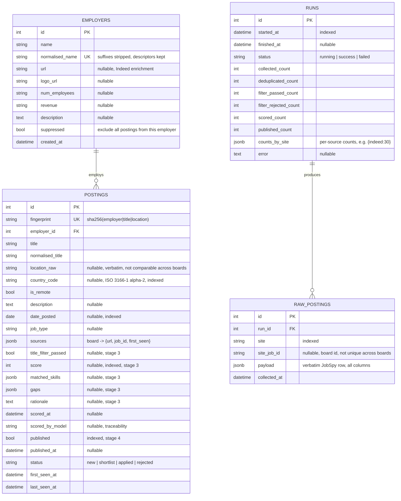
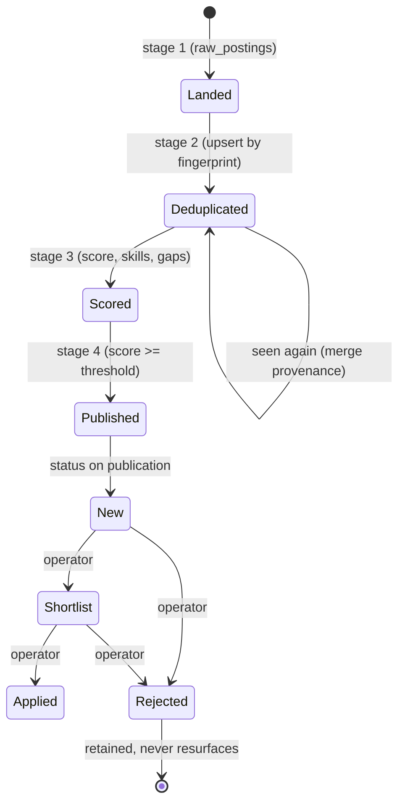

# Design Document — Data Model
## Automated Job Discovery Pipeline

| | |
|---|---|
| **Version** | 1.0 |
| **Date** | 21 July 2026 |
| **Status** | Approved |
| **Related** | [System Architecture](system-architecture.md), [SRS](../software-requirements-specification.md) |

---

## 1. Overview

The model has four entities. Two are landing/audit structures (`raw_postings`,
`runs`) and two are the domain (`employers`, `postings`). The design follows the
staging principle of design §7.2: raw collector output is retained verbatim and
append-only, and the deduplicated domain is derived from it, so the domain can be
rebuilt without re-collecting.

The store is PostgreSQL 16 with the pgvector extension enabled. JSON columns use
`JSONB`; the models declare a `JSON` variant for SQLite so the suite runs without
a database (Development Guide §4).

---

## 2. Entity–relationship diagram



**Note on relationships.** `postings` has no foreign key to `runs`. The link from
a posting back to the run(s) that surfaced it is intentionally indirect: a posting
is one real-world role that may be seen across many runs, whereas each
`raw_postings` row belongs to exactly one run. Provenance across runs is carried
in `postings.sources` and the `first_seen_at` / `last_seen_at` timestamps.

---

## 3. Entities

### 3.1 `employers`

Normalised employer records. `normalised_name` is the deduplication key — legal
suffixes removed, descriptor words retained (SRS FR-11) — and is unique. The
enrichment columns (`url`, `logo_url`, `num_employees`, `revenue`, `description`)
are populated opportunistically from Indeed, which carries company detail that
LinkedIn does not; they are filled only when empty and never overwritten.

`suppressed` excludes an employer entirely, including postings not yet seen. This
is distinct from posting-level rejection (§3.4).

### 3.2 `runs`

One row per pipeline execution. The count columns make each stage's throughput
auditable, and `counts_by_site` makes per-source decay visible — the observability
requirement of SRS NFR-4. `status` is `running` until a terminal transition; a row
left at `running` means the process died.

### 3.3 `raw_postings`

Append-only landing zone. `payload` holds the complete JobSpy row unchanged, so a
later decision to promote a field is a backfill over stored data rather than a
re-collection (SRS FR-8). `site_job_id` is the board's own identifier, retained
for diagnosis; it is not unique across boards and is not a key.

### 3.4 `postings`

One row per real-world role, keyed on `fingerprint`. Columns fall into groups:

- **Identity and provenance:** `fingerprint`, `employer_id`, `sources`.
- **Display and comparison:** `title`, `normalised_title`, `location_raw`,
  `country_code`, `is_remote`, `description`, `date_posted`, `job_type`. Note
  that `location_raw` is verbatim and **not comparable across boards** (one may
  render a city in Arabic, another in English); `country_code` is the comparable,
  parsed value and the one used in the fingerprint.
- **Scoring (stage 3):** `title_filter_passed`, `score`, `matched_skills`,
  `gaps`, `rationale`, `scored_at`, `scored_by_model`. All nullable until scored.
- **Publication and triage (stage 4):** `published`, `published_at`, `status`.

`status` doubles as the suppression mechanism: `rejected` is retained
indefinitely and never resurfaces (SRS FR-23, FR-27), so no separate
posting-level suppression flag is needed.

---

## 4. Keys, indexes and constraints

| Table | Constraint / index | Purpose |
|---|---|---|
| `employers` | `normalised_name` unique | The deduplication key |
| `raw_postings` | `run_id` → `runs.id`, `ON DELETE CASCADE` | Deleting a run reclaims its landed rows |
| `raw_postings` | index on `site`, `site_job_id` | Diagnosis by board |
| `postings` | `fingerprint` unique | One record per real-world role |
| `postings` | `employer_id` → `employers.id` | Employer relationship |
| `postings` | index on `country_code`, `date_posted`, `score`, `published`, `status` | Filtering and ranking |
| `postings` | composite `ix_postings_triage_queue` (`published`, `status`, `score`) | The list view's primary query |

---

## 5. The fingerprint

The fingerprint is the model's most consequential derived value (SRS FR-9):

```
fingerprint = sha256( normalised_employer | normalised_title | location_token )
```

- `normalised_employer` — lowercased, accent- and punctuation-stripped, legal
  suffixes removed, bilingual names reduced to their Latin portion.
- `normalised_title` — lowercased and cleaned, but seniority and discipline
  markers retained.
- `location_token` — the ISO country code for on-site roles, `REMOTE` for remote
  roles, or `UNKNOWN` where the country cannot be resolved.

City is deliberately **not** an input: boards localise city names irreconcilably,
so including it would guarantee the duplicates the fingerprint exists to prevent
(design §7.3.1). `UNKNOWN` is kept distinct from `REMOTE` so that unresolved
locations remain countable rather than silently merging.

---

## 6. Lifecycle of a posting



A posting seen again in a later run does not create a new record: its provenance
is merged and `last_seen_at` advanced, while scoring and triage state are left
undisturbed.

---

## 6a. Feature 001 additions (ADR-0005)

Two tables were added for operator self-service, plus active use of a dormant
column. Full detail in [specs/001-ui-self-service/data-model.md](../../specs/001-ui-self-service/data-model.md).

| Entity | Purpose |
|---|---|
| **`search_profiles`** | Named, individually scheduled job surveys; supersede the `SEARCHES` env list. Seeded from `SEARCHES` on migration |
| **`app_settings`** | Runtime-editable operational settings; resolution order `app_settings → env → code default` |
| `employers.suppressed` | Now the blacklist flag (was dormant): a suppressed employer's postings are auto-rejected and retained |
| `runs.profile_id` | Nullable FK attributing a run to the profile that triggered it |

## 7. Migrations

The schema is managed by Alembic. Migrations as at this version:

| Revision | Description |
|---|---|
| `ff6adc50ab28` | Initial schema; enables the `vector` extension up front |
| `dc0d779245f2` | Replaces Notion delivery fields with the `status` column (ADR-0004); backfills existing rows |
| `f35d01e216d8` | Partial index on suppressed employers (blacklist, US3) |
| `3374777f0db4` | Adds `search_profiles` and `app_settings`; `runs.profile_id`; seeds profiles from `SEARCHES` (ADR-0005) |

The `vector` extension is created in the first migration though no column uses it
yet, to avoid a future migration whose only purpose is the extension (design §14).
It is deliberately not dropped on downgrade, since dropping an extension is
database-wide.

*End of document.*
