# Design Document — Paradigm Assignment and Object Model Refactor
## Automated Job Discovery Pipeline

| | |
|---|---|
| **Version** | 2.0 |
| **Date** | 22 July 2026 |
| **Status** | Proposal |
| **Supersedes** | Revision 1 (whole-system OOP conversion), withdrawn — see §4 |
| **Related** | [System Architecture](system-architecture.md), [Data Model](data-model.md), [ADR-0004](../ADRs/0004-web-app-replaces-notion.md), [ADR-0005](../ADRs/0005-ui-config-and-db-search-profiles.md) |

---

## Summary

Revision 1 of this study proposed converting the whole codebase to an object
model. Running each component against the paradigm its problem actually has
shows that four paradigms are already in use here, and three of them are already
being applied correctly. What remains is a much smaller object-oriented change,
plus one configuration axis worth investing in — and one live bug found on the
way (§10).

Basis: 26 modules, 2,312 lines, branch `001-ui-self-service`.

---

## 1. What the refactor is actually fixing

The present design is a competent procedural one. It is not broken. Four
specific frictions in it are structural, and each is what an object model exists
to remove — these four, and no more, are the justification for the work in §4
through §11.

> **Friction 1 — global mutation as a configuration channel.**
> `store.apply_to_settings()` writes DB overrides onto the process-wide
> `Settings` singleton at the start of every run. Two runs cannot hold different
> configurations, and no test can assert a configuration without leaking it into
> the next test.

> **Friction 2 — the stage sequence is hard-coded.**
> `orchestrate._run()` names `run_collect`, `run_normalise` and `run_suppress`
> literally. Adding the unbuilt stages 3 and 4 means editing the orchestrator,
> the CLI, the six count columns on `runs`, and the health view.

> **Friction 3 — source differences live in an if-chain.**
> `collect_one()` branches on site name to decide `country_indeed`,
> `google_search_term` and `linkedin_fetch_description`. Each new board adds a
> branch to a function that already knows too much about four of them.

> **Friction 4 — domain rules sit in HTTP handlers.**
> `web/app.py` validates the status transition, stamps `last_seen_at`, sets
> `employer.suppressed` and then calls `suppress_employer`. The CLI cannot
> invoke those rules; the scheduler never learns that a profile's schedule
> changed.

---

## 2. Paradigm assignment

Paradigm is a property of a problem, not of a codebase. Run each component
against the question its own shape asks, and this system selects four different
answers — most of which it is already giving correctly. The refactor's scope is
exactly the set of components whose current paradigm does not match their
problem.

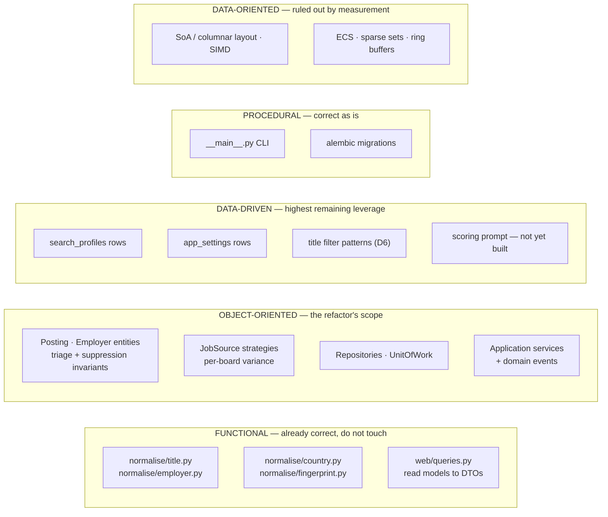

*Figure 1 — Paradigm assignment by component. Three of the five groups need no
work. That is the finding; revision 1 of this document proposed changes to all
of them.*

### 2.1 Why data-oriented design is the one that misses

Not a matter of taste. The project's own requirements close it, and the
arithmetic is not close.

| Budget line | Magnitude | Source |
|---|---|---|
| Target run wall-clock | ~10⁵ ms (minutes) | NFR-1 |
| Deliberate inter-request delay | 10,000 ms per request | §9.3, by design |
| LinkedIn per-posting description fetch | ~50 extra HTTP round trips | `linkedin_fetch_description` |
| Postgres round trips in stage 2 (N+1) | ~200 queries ≈ 200 ms | `normalise_stage.py:88,28` |
| **Actual CPU in normalisation, 100 rows** | **≈ 2.5 ms** | 2 regex passes + SHA-256 per row |

The transformation cost this system performs is roughly **0.001% of a run**.
Make it infinitely fast — free, zero — and nothing observable changes. Worse,
the binding constraint is a delay the system imposes *on purpose*: data-oriented
design optimises precisely the dimension being deliberately de-optimised for
collection etiquette.

Two further reasons it cannot pay here. In CPython the memory layout DOD depends
on is unreachable without leaving the object model entirely — every field is a
boxed `PyObject` behind a pointer. And §9.2 states the position outright:
publication is *"a database update over fewer than one hundred rows daily and is
not a throughput consideration."*

> **One honest exception, noted and dismissed.**
> `jobspy_client.py:50` calls `df.to_dict(orient="records")` — JobSpy hands back
> a columnar DataFrame and the first thing this code does is shred it into row
> dicts. That is the single genuinely anti-columnar line in the codebase. At
> ~100 rows it is correctly irrelevant, and `raw_postings` needs per-row JSONB
> anyway. It is recorded here only so that a future thousandfold increase in
> volume has a known place to start.

---

## 3. Target architecture

Ports and adapters, applied only to the object-oriented group from §2. The
domain layer holds entities, value objects and the abstract ports it needs; it
imports neither SQLAlchemy nor FastAPI nor JobSpy. The functional modules sit
alongside it and are called directly — they need no port, because a pure
function has no dependency to invert.

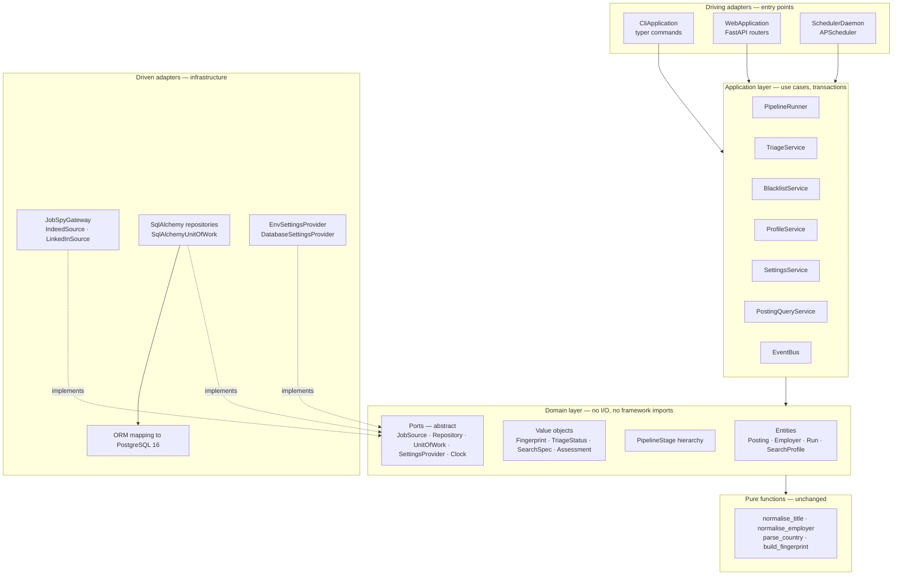

*Figure 2 — Component and dependency view. Arrows point in the direction of
dependency. Nothing points out of the domain layer. The pure-function group is
called, never injected.*

---

## 4. Domain model

`Posting` becomes an aggregate root. Today it is an anaemic row: every rule
about it lives elsewhere — the born-rejected rule in `normalise_stage`, the
transition validation in a route handler, the suppression rule in
`suppress_stage`. Collecting those onto the entity is the single largest change
in this document, and the one that best justifies OOP: these are genuine
invariants attached to a noun.

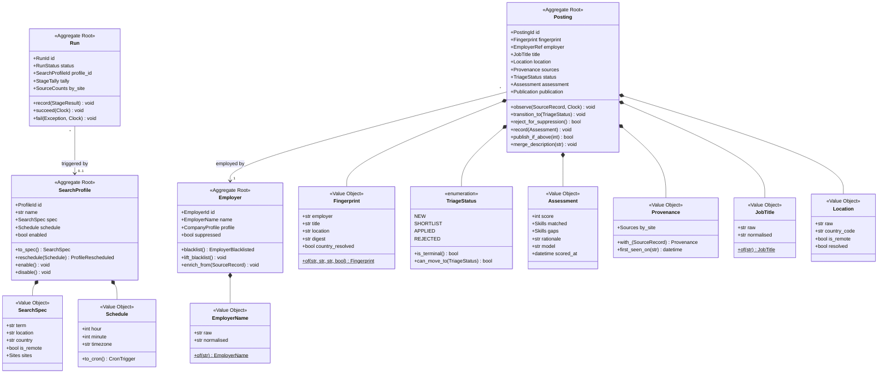

*Figure 3 — Domain class diagram. The value objects are thin wrappers whose
factories delegate to the existing pure functions: `EmployerName.of()` calls
`normalise_employer()`, `Fingerprint.of()` calls `build_fingerprint()`. No
normalisation logic is rewritten or moved — it is given a type.*

### 4.1 Rules that move onto the entity

| Rule | Lives today in | Moves to |
|---|---|---|
| A posting from a suppressed employer is born *rejected* (FR-007) | `normalise_stage.py:103` | `Posting` factory |
| Only the four known statuses are valid targets | `web/app.py:98` | `TriageStatus.can_move_to` |
| Rejecting a posting also un-publishes it | `suppress_stage.py:37` | `Posting.transition_to` |
| A description is backfilled but never overwritten | `normalise_stage.py:132` | `Posting.merge_description` |
| Enrichment fills gaps only, never overwrites | `normalise_stage.py:41-49` | `Employer.enrich_from` |
| Re-observing merges provenance, never duplicates | `normalise_stage.py:119-128` | `Provenance.with_` |

### 4.2 Explicitly out of scope

The normalisation logic itself. `normalise/title.py`, `employer.py`,
`country.py` and `fingerprint.py` are pure, deterministic, side-effect-free
functions over strings with no collaborators — functional programming applied to
a functional problem, and already correct.

**Revision 1 of this document proposed decomposing them into
`NormalisationRule` class chains. That was symmetry, not need, and it is
withdrawn.** These four modules are not modified in any phase.

---

## 5. Persistence data model

The refactor is behavioural, not a schema rewrite: five of the six tables keep
their columns exactly. Two changes are worth making because the object model
makes the current shape awkward, and both are additive.

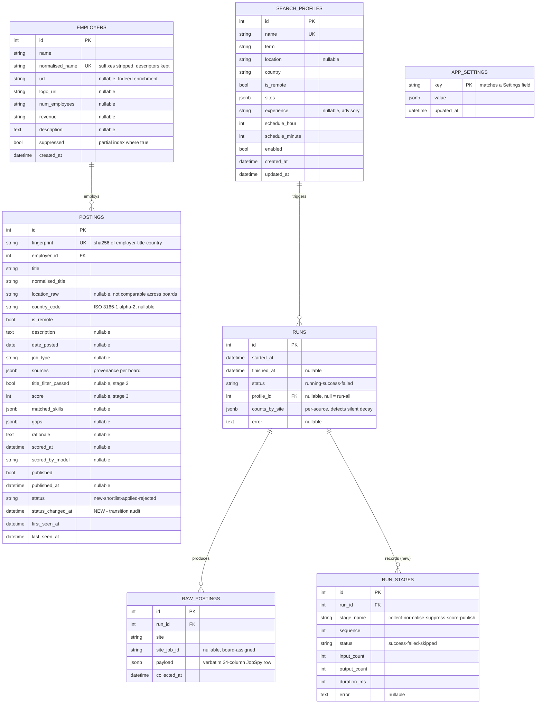

*Figure 4 — Entity–relationship diagram, target state.*

| Change | Table | Rationale | Kind |
|---|---|---|---|
| `run_stages` replaces the six count columns on `runs` | `runs` → `run_stages` | Once a stage is a class, adding stage 3 should not require a migration for `scored_count`. One row per stage per run makes the tally polymorphic and sharpens the §7.4 decay signal — *which* stage is shrinking, not just the total. Deferred with phase 4; only worth it if stages 3–4 are being built. | additive |
| `status_changed_at` added to `postings` | `postings` | Transitions currently overload `last_seen_at`, which also means "a board surfaced this again". Two facts, one column. Separating them is a prerequisite for `Posting.transition_to()` being honest about what it stamps. | additive |
| `status` stays a string column | `postings` | Mapped to `TriageStatus` in the ORM layer, not by a native PostgreSQL enum type — which would make adding a state a locking DDL change for no gain. | unchanged |
| Rich declarative models, not imperative mapping | all | Keep `db/models.py` and add behaviour to those classes; value objects become SQLAlchemy composites. See §8. | decided |

---

## 6. Collection — sources as strategies

Each board becomes a class holding its own quirks. This is behavioural variance
between boards, which is what polymorphism is for — as distinct from the string
transformations in §4, which are data variance and stay functional.

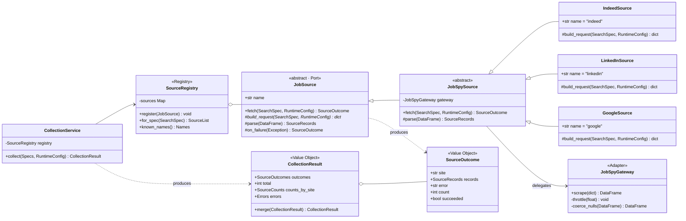

*Figure 5 — Strategy + Adapter + Registry over the collectors.
`JobSpyGateway.throttle()` is where the missing `request_delay_seconds` belongs
— see §10. The gateway is the only object that knows a network call is being
made, so it is the only correct home for pacing it.*

> **The payoff is testability, not extensibility.**
> There will probably never be twenty boards. But a `FakeSource` returning a
> canned frame lets stage 1 be tested without monkey-patching
> `jobspy.scrape_jobs`, which is what `test_collect.py` must do today.

---

## 7. The pipeline — stages as objects

A composite of template methods, with a batch-in / batch-out contract. This is
the one place the dataflow framing genuinely contributes: a stage is a stateless
transform between durable buffers, and the buffers are database tables rather
than memory because the requirement is re-runnability, not throughput.

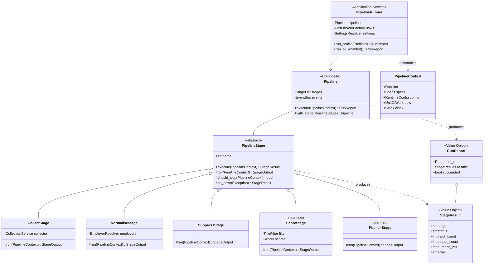

*Figure 6 — Pipeline, stages and the run context. The context carries a `Clock`
port so `first_seen_at` and the idempotency of re-normalisation are
deterministically testable, rather than calling `datetime.now(UTC)` inside the
stage. `track_run` dissolves into `Pipeline.execute()`.*

> **Where set-based thinking does pay.**
> `NormaliseStage` currently issues two queries per raw row — a fingerprint
> lookup and an employer lookup — roughly 200 round trips per run. Batching them
> into one `IN` query each is the only place in this codebase where "think in
> batches, not rows" buys a measurable improvement. It is ~200 ms, so do it
> while rewriting the stage; do not do it for its own sake.

---

## 8. Persistence — repositories and unit of work

Today `run_collect`, `run_normalise` and `run_suppress` each call
`session.commit()` themselves, so a failure in stage 2 leaves stage 1's commit
standing. That is defensible for a staging pipeline — but it should be a
decision the orchestrator makes, not one each stage makes for itself.

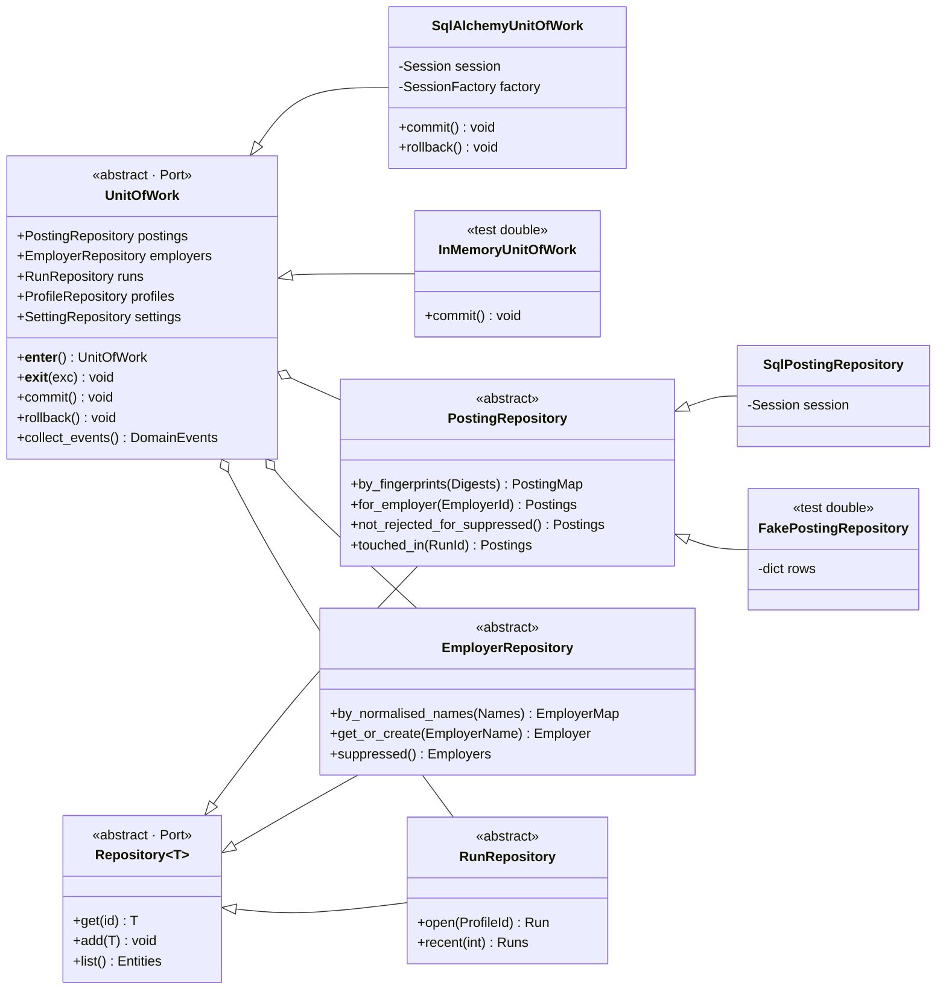

*Figure 7 — Repository + Unit of Work. Note the plural lookups —
`by_fingerprints`, `by_normalised_names`. Designing the repository interface
batch-first is what makes the §7 fix natural rather than an optimisation bolted
on later.*

> **Decided — keep declarative models.**
> Imperative mapping (`registry.map_imperatively()`) would make the domain
> layer's "no framework imports" claim literally true, at the cost of a mapping
> file per entity. For a single-operator system with one database that is
> ceremony. Keep `db/models.py` as declarative classes and add behaviour to
> them; express value objects as SQLAlchemy composites. Revisit only if a second
> persistence target ever appears.

---

## 9. Configuration — a resolution chain, not a mutated global

This removes the hazard in friction 1. The ADR-0005 note calls the current
global mutation "acceptable for a single-operator system", which is true — and
is exactly the kind of acceptance an explicit resolution chain lets you stop
making.

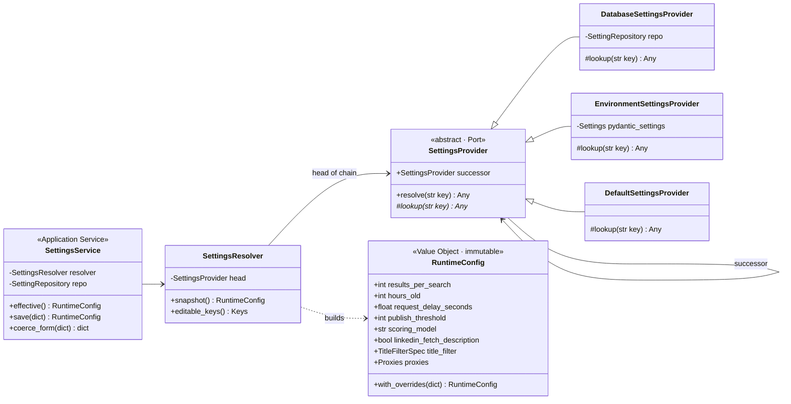

*Figure 8 — Chain of Responsibility over configuration sources. The chain
encodes the ADR-0005 resolution order structurally: database override →
environment/.env → code default. A `RuntimeConfig` snapshot is taken once when a
run opens and passed down the pipeline, so a run's configuration is fixed for
its duration.*

---

## 10. The data-driven surface — and a hole in it

ADR-0005 already moved behaviour out of code and into database rows: schedules,
sites, search terms, thresholds, title filters. That is textbook data-driven
design, it is why UI self-service was buildable at all, and it is the axis with
the most remaining leverage — the only one that lets the system's behaviour
change without touching code.

It also has a specific failure mode that neither OOP nor FP has: **configuration
that drives nothing fails silently, because no compiler checks that a setting
reaches a call site.** Auditing all nine editable keys against their consumers
found one.

| Editable key | Declared | Validated | Consumed by | State |
|---|---|---|---|---|
| `results_per_search` | ✓ | ✓ positive | `collect_one` → `results_wanted` | live |
| `hours_old` | ✓ | ✓ positive | `collect_one` → `hours_old` | live |
| `linkedin_fetch_description` | ✓ | ✓ | `collect_one` → kwarg | live |
| `proxies` | ✓ | ✓ | `collect_one` → `proxies` | live |
| `request_delay_seconds` | ✓ `config.py:51` | ✓ non-negative | **nothing — never passed** | **broken** |
| `publish_threshold` | ✓ | ✓ 0–100 | stage 4 — unbuilt | pending |
| `scoring_model` | ✓ | ✓ | stage 3 — unbuilt | pending |
| `title_include_pattern` | ✓ | ✓ | stage 3 — unbuilt | pending |
| `title_exclude_pattern` | ✓ | ✓ | stage 3 — unbuilt | pending |

> **Bug — the primary rate-limit remedy does nothing.**
> `request_delay_seconds` is declared at `config.py:51`, validated at
> `store.py:41-46`, listed in `EDITABLE_KEYS`, rendered on the settings page and
> covered by two tests — and it is never passed to anything. It does not appear
> in the `scrape_jobs` kwargs built by `collect_one()`, and the installed
> JobSpy's signature has no delay parameter at all.
>
> Per §9.3, raising this delay is *the first remedy* when a board begins
> restricting access, which is the top item in the risk register. The primary
> documented mitigation for the primary operational risk is inert. It belongs in
> `JobSpyGateway.throttle()` (§6), sleeping between calls in this application's
> own code rather than hoping the library honours it.

### 10.1 Closing the class of bug, not just the instance

One test makes this category impossible to reintroduce — assert that every key
in `EDITABLE_KEYS` is either read by a named consumer or explicitly registered
as pending against an unbuilt stage. It is the data-driven equivalent of a
compiler warning for an unused parameter.

### 10.2 Where to extend the data-driven surface next

- The stage 3 scoring prompt should be an `app_settings` row, not a Python
  string literal — prompt iteration is the highest-frequency change a scorer
  will ever see, and the design already requires `scored_by_model` so a prompt
  change stays traceable.
- The D6 title filter is already data. Keep it that way; resist compiling it
  into a `TitleFilter` class hierarchy.
- Anything a single operator will want to tune weekly belongs here. Anything
  with an invariant attached to it belongs in §4.

---

## 11. Application services and domain events

Web routes and CLI commands become adapters that translate a request into a
service call. The same `BlacklistService.blacklist()` serves an HTMX post and a
future `python -m app blacklist` command.

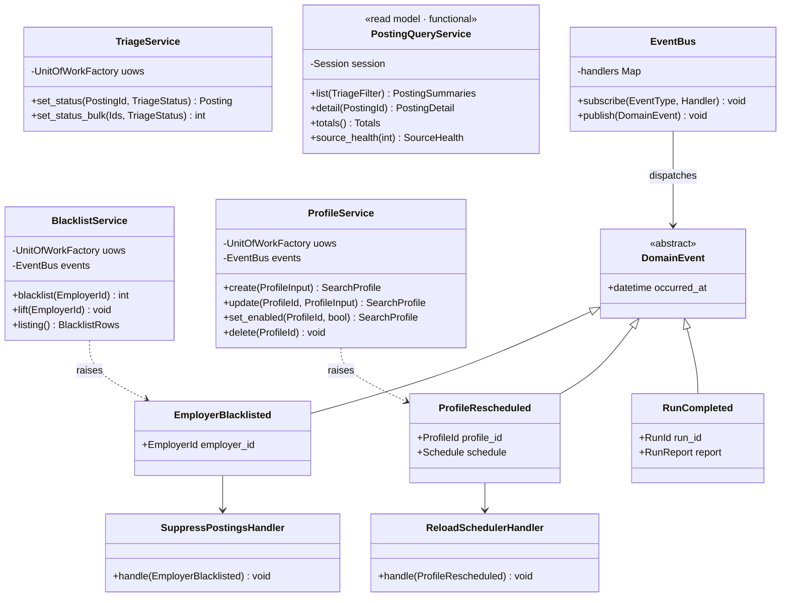

*Figure 9 — Services, events and subscribers.*

> **This fixes a live gap, not a hypothetical one.**
> `scheduler.py` registers one APScheduler job per enabled profile at process
> start and never reloads. Its own docstring says "on profile change the jobs
> are reloaded" — nothing does that. Editing a schedule at `/profiles` has no
> effect until the container restarts. `ProfileRescheduled →
> ReloadSchedulerHandler` is the seam that closes it, and `_register_jobs` is
> already written to be re-callable.

---

## 12. Behaviour

Two lifecycles currently enforced by scattered `if` statements, and the two
sequences that exercise most of the design.

### 12.1 Posting triage lifecycle

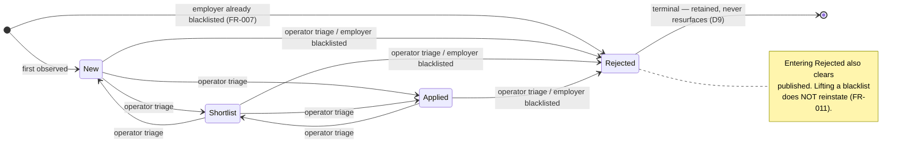

*Figure 10 — Posting triage lifecycle.*

**Decision needed.** The current code permits any status to be set from any
other, including out of Rejected. Making Rejected terminal is a behavioural
change, not a refactor — confirm before implementing.

### 12.2 Run lifecycle

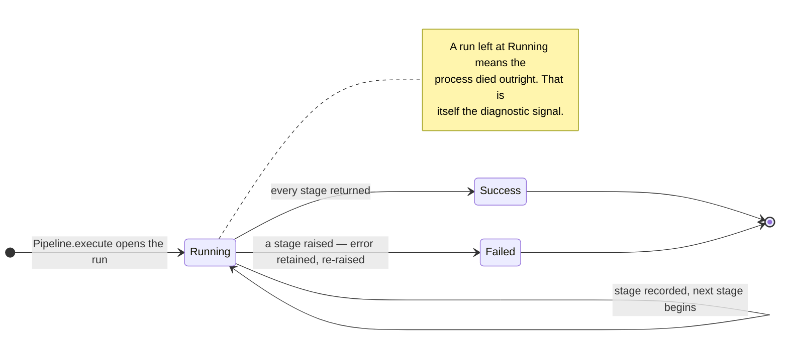

*Figure 11 — Run lifecycle.*

### 12.3 Scheduled run of one search profile

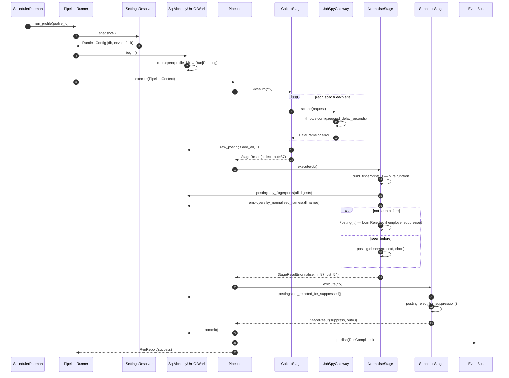

*Figure 12 — Scheduled run. Two changes from today are visible: the batched
repository lookups replacing per-row queries, and `throttle()` finally consuming
the setting from §10.*

### 12.4 Operator blacklists an employer

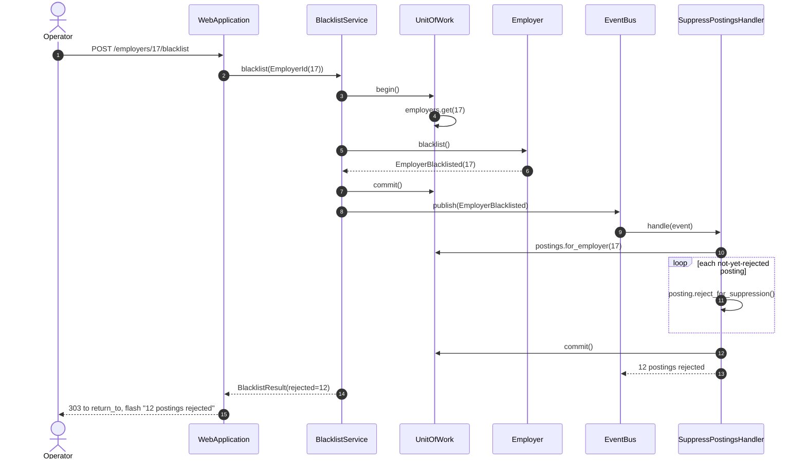

*Figure 13 — Blacklist an employer. Compare with today: the route sets
`employer.suppressed = True`, commits, calls `suppress_employer(db, id)`
directly, and redirects without telling the operator how many postings were
affected.*

---

## 13. Module-to-paradigm map

Every existing module, its paradigm, and its disposition. Six modules totalling
340 lines are explicitly untouched.

| Module | Lines | Paradigm | Disposition |
|---|---|---|---|
| `normalise/fingerprint.py` | 65 | functional | unchanged — wrapped by `Fingerprint` VO |
| `normalise/employer.py` | 82 | functional | unchanged |
| `normalise/title.py` | 39 | functional | unchanged |
| `normalise/country.py` | 114 | functional | unchanged |
| `web/queries.py` | 115 | functional | rename to `PostingQueryService`; DTOs already correct |
| `db/models.py` | 291 | object | keep classes, add behaviour + `status_changed_at` |
| `collect/jobspy_client.py` | 118 | object | `JobSpyGateway` · `IndeedSource` · `LinkedInSource` |
| `config.py` | 89 | object | `EnvironmentSettingsProvider` · `RuntimeConfig` |
| `db/session.py` | 37 | object | `SqlAlchemyUnitOfWork` · `UnitOfWorkFactory` |
| `pipeline/collect_stage.py` | 89 | object | `CollectStage` |
| `pipeline/normalise_stage.py` | 144 | object | `NormaliseStage` — rules move onto entities, queries batched |
| `pipeline/suppress_stage.py` | 63 | object | `SuppressStage` · `SuppressPostingsHandler` |
| `pipeline/run.py` | 50 | object | absorbed into `Pipeline.execute` |
| `pipeline/orchestrate.py` | 56 | object | `PipelineRunner` · `Pipeline` · `PipelineContext` |
| `settings_store/store.py` | 150 | data-driven | `SettingsService` + provider chain |
| `settings_store/profiles.py` | 139 | data-driven | `ProfileService` · `ProfileRepository` |
| `scheduler.py` | 51 | object | `SchedulerDaemon` · `ReloadSchedulerHandler` |
| `web/app.py` | 346 | object | routers only — delegate to services |
| `__main__.py` | 187 | procedural | stays procedural; command bodies delegate to services |

---

## 14. Sequencing

A phase 0 that is not a refactor at all, then four phases each independently
shippable and each leaving the suite green. No phase requires the next to be
worth doing — which is the property that makes it safe to stop partway.

| Phase | Work | Unlocks | Verdict |
|---|---|---|---|
| **0** | Pass `request_delay_seconds` to a real sleep between collector calls. Add the "every editable key has a consumer" test. Fix the scheduler reload directly if phase 5 is not being done. | The documented remedy for board restriction actually works. | **do first** |
| **1** | Value objects and entity behaviour. `Fingerprint`, `TriageStatus`, `EmployerName`, `JobTitle` as thin types over the existing pure functions; move the six rules from §4.1 onto `Posting` and `Employer`. | Domain rules unit-testable without a database. | recommended |
| **2** | Repositories and Unit of Work behind the existing stage functions, with batch-first lookups. | Fakes replace SQLite in tests; the N+1 disappears. | recommended |
| **3** | Settings chain and `RuntimeConfig`. Delete `apply_to_settings` and thread the snapshot through. | Kills global mutation. Prerequisite for any concurrency. | recommended |
| **4** | Stage classes, `Pipeline`, `run_stages` table. | Stages 3 and 4 become additions, not edits. | only if scoring is being built |
| **5** | Application services, event bus, thin routers. | Scheduler reload; web and CLI reach identical behaviour. | only if a second entry point matters |

> **Revised accounting.**
> Revision 1 estimated 26 modules → ~55 and 2,312 lines → ~3,000–3,400. With the
> normalisers out of scope and phases 4–5 made conditional, phases 0–3 come to
> roughly **26 modules → ~38, and ~2,312 lines → ~2,650** — about 15% more code,
> concentrated entirely on the four frictions in §1. That is a proportionate
> change for a 2,300-line single-operator system. The previous estimate was not.

---

## 15. Pattern register

| Pattern | Applied to | Problem it removes | Phase |
|---|---|---|---|
| Value Object | `Fingerprint`, `TriageStatus`, `RuntimeConfig` | Primitive obsession; validity re-checked at every use site | 1 |
| Aggregate / rich entity | `Posting`, `Employer` | Invariants scattered across three layers | 1 |
| Repository | Posting / Employer / Run / Profile | Queries inlined in business logic; N+1 lookups | 2 |
| Unit of Work | `SqlAlchemyUnitOfWork` | Each stage deciding its own commit boundary | 2 |
| Chain of Responsibility | `SettingsProvider` only | Global mutation as a config channel | 3 |
| Strategy | `JobSource` hierarchy | Site-specific branching in `collect_one` | 3 |
| Adapter | `JobSpyGateway` | Direct `scrape_jobs` coupling; forces monkey-patching in tests | 3 |
| Registry | `SourceRegistry` | `WORKING_SITES` validated in three places | 3 |
| Template Method | `JobSource.fetch`, `PipelineStage.execute` | Repeated try/except/count/log scaffolding | 4 |
| Composite | `Pipeline` | Hard-coded stage sequence | 4 |
| Facade / Application Service | `TriageService`, `BlacklistService`, … | Domain rules reachable only over HTTP | 5 |
| Observer / domain events | `EventBus` + handlers | Scheduler never reloading | 5 |
| **— none, deliberately** | `normalise/*` | Pure functions need no pattern | — |

Phases 0–3 account for eight of these. The remaining four are contingent on
stages 3 and 4 being built. If scoring and publication are shelved, stop after
phase 3 and leave `orchestrate.py` exactly as it is.
