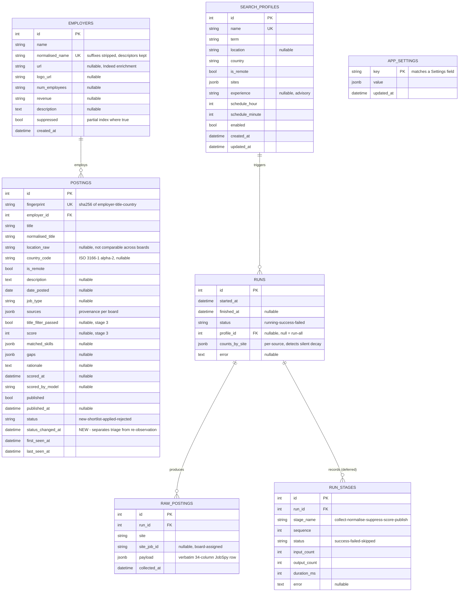
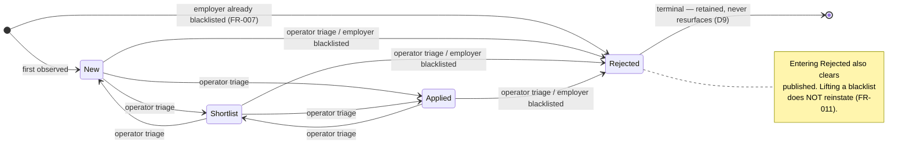
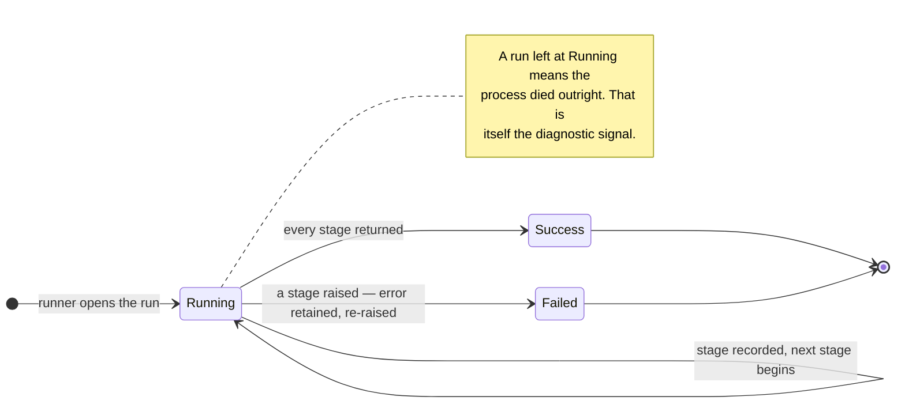
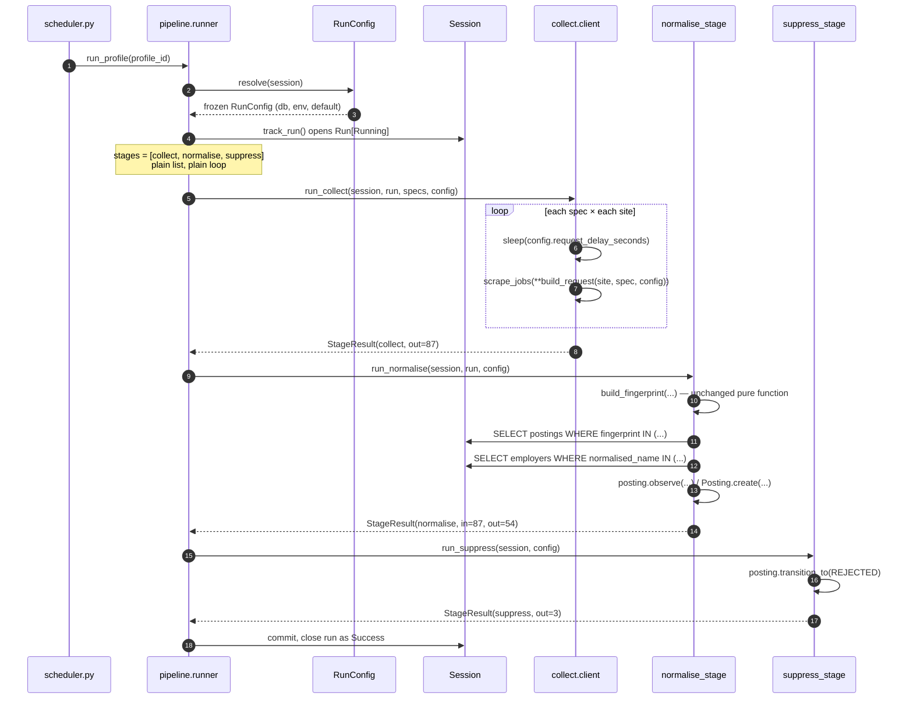
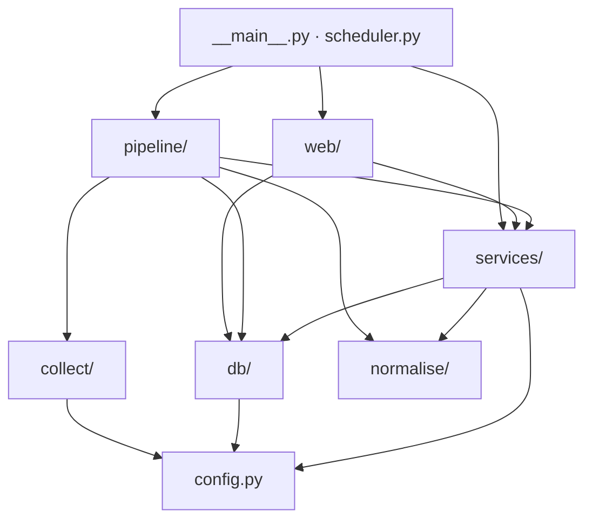

# Design Document — Refactor Plan and Package Restructure
## Automated Job Discovery Pipeline

| | |
|---|---|
| **Version** | 3.0 |
| **Date** | 22 July 2026 |
| **Status** | Proposal |
| **Supersedes** | Rev 1 (whole-system OOP conversion) and Rev 2 (ports and adapters), both withdrawn — see §1 |
| **Related** | [System Architecture](system-architecture.md), [Data Model](data-model.md), [ADR-0005](../ADRs/0005-ui-config-and-db-search-profiles.md) |

---

## Summary

Two earlier revisions of this document proposed progressively smaller versions of
an enterprise architecture — Domain-Driven Design aggregates, then ports and
adapters. Both were disproportionate to a 2,312-line, single-operator system that
processes fewer than one hundred rows a day, and both are withdrawn.

What is left is three phases of ordinary work: fix two bugs, stop mutating a
global, and move logic to where it belongs — plus a package restructure that
gives that logic somewhere to go. Net line count is roughly flat.

---

## 1. What was withdrawn, and why

| Proposed in Rev 1/2 | Withdrawn because |
|---|---|
| `SqlAlchemyUnitOfWork` | SQLAlchemy's `Session` *is* a Unit of Work. Wrapping it is a second UoW around the first. |
| `PostingRepository` etc. as abstract ports | The motives were naming business queries (needs functions, not a pattern) and enabling test fakes (the suite already runs on in-memory SQLite, which is fast and real). |
| `SettingsProvider` chain of responsibility | `store.get()` already resolves DB → env → default correctly in eight lines. The defect is only that `apply_to_settings()` mutates a global. |
| `EventBus` + domain events | Indirection for a function call — and it cannot work here at all. See §2.2. |
| `JobSource` ABC hierarchy | A dict of `site → build_request` functions plus one wrapper for the try/except gets the same result at a fifth the size. |
| `Pipeline` composite + `PipelineStage` template method | A list of callables and a `for` loop. Per-stage counts come from a small dataclass return. |
| `EmployerName` / `JobTitle` value objects | They would wrap a `str` in a type Python does not enforce at runtime. |
| `Fingerprint` value object | **Already exists.** `FingerprintParts` in `normalise/fingerprint.py:45` has been a frozen dataclass since the initial commit. |

Rev 2's own pattern register observed that "twelve patterns is a lot for 2,300
lines". Noticing the smell and writing a disclaimer is not the same as cutting.

### 1.1 What survives unchanged from Rev 2

- The four frictions in Rev 2 §1 are real. The remedies were oversized, not the
  diagnosis.
- `normalise/title.py`, `employer.py`, `country.py` and `fingerprint.py` stay
  exactly as they are: pure, deterministic, side-effect-free functions over
  strings. They are not touched in any phase.
- The two schema changes (§5) and the `Rejected`-is-terminal decision (§6.1).

---

## 2. Phase 1 — two bugs

Neither is a refactor. Both should be fixed before any restructuring.

### 2.1 `request_delay_seconds` never reaches a call site

Declared at `config.py:51`, validated at `store.py:41-46`, listed in
`EDITABLE_KEYS`, rendered on the settings page, covered by two tests — and never
passed to anything. It does not appear in the `scrape_jobs` kwargs built by
`collect_one()`, and the installed JobSpy's signature has no delay parameter.

Per design §9.3, raising this delay is *the first remedy* when a board begins
restricting access, which is the top item in the risk register. The fix is a
`time.sleep()` between collector calls in this application's own code, not a
kwarg handed to a library that ignores it.

One test closes the whole class of bug: assert every key in `EDITABLE_KEYS` is
either read by a named consumer or explicitly registered as pending against an
unbuilt stage. It is the data-driven equivalent of an unused-parameter warning.

### 2.2 The scheduler never reloads, and an event bus cannot fix it

`scheduler.py` registers one APScheduler job per enabled profile at process start
and never reloads. Its own docstring claims "on profile change the jobs are
reloaded" — nothing does that. Editing a schedule at `/profiles` has no effect
until the container restarts.

Rev 2 proposed an in-process `EventBus` to close this. **That cannot work.**
`docker-compose.yml` runs `web` (`python -m app web`) and `scheduler`
(`python -m app serve`) as two separate containers from one image. An event
published in the web process will never reach the scheduler process.

Two mechanisms that do work, both smaller than an event bus:

| Option | How | Cost |
|---|---|---|
| **Poll** (recommended) | A standing APScheduler job every *n* minutes re-reads profiles and calls the existing `_register_jobs()` when the maximum `updated_at` has moved. | ~15 lines. `_register_jobs` is already written to be re-callable. |
| Shared job store | Give APScheduler a `SQLAlchemyJobStore` on the same database so both processes see one job table. | Larger blast radius; couples job state to the schema. |

---

## 3. Phase 2 — stop mutating the global

`store.apply_to_settings()` writes database overrides onto the process-wide
`Settings` singleton at the start of every run, so the collector picks them up
through existing `settings.x` call sites. Two runs cannot hold different
configurations, and no test can assert one without leaking it into the next.

The replacement is a single immutable snapshot built once per run and passed as
an argument:

```python
class RunConfig(BaseModel, frozen=True):
    """Effective configuration for one run. Built once, never mutated."""
    results_per_search: int
    hours_old: int
    request_delay_seconds: float
    linkedin_fetch_description: bool
    proxies: list[str]
    publish_threshold: int
    scoring_model: str
    title_include_pattern: str
    title_exclude_pattern: str

    @classmethod
    def resolve(cls, session: Session) -> "RunConfig":
        """DB override, else environment/.env, else code default."""
        return cls(**{k: settings_service.get(session, k) for k in EDITABLE_KEYS})
```

`settings_service.get()` is the existing `store.get()`, unchanged — the
resolution order was never the problem. `apply_to_settings()` is deleted, and
every stage function takes `config: RunConfig` as a parameter.

---

## 4. Phase 3 — move logic to where it belongs

Three moves, no new abstractions.

### 4.1 Rules onto the ORM models

These are invariants attached to a noun, currently scattered across three layers.
They become methods on the existing declarative classes in `db/models.py` — not
DDD aggregates, just ordinary methods.

| Rule | Lives today in | Becomes |
|---|---|---|
| A posting from a suppressed employer is born *rejected* (FR-007) | `normalise_stage.py:103` | `Posting.create()` classmethod |
| Only the four known statuses are valid targets | `web/app.py:98` | `Posting.transition_to()` |
| Rejecting a posting also un-publishes it | `suppress_stage.py:37` | `Posting.transition_to()` |
| A description is backfilled but never overwritten | `normalise_stage.py:132` | `Posting.merge_description()` |
| Enrichment fills gaps only, never overwrites | `normalise_stage.py:41-49` | `Employer.enrich_from()` |
| Re-observing merges provenance, never duplicates | `normalise_stage.py:119-128` | `Posting.observe()` |

### 4.2 Business operations into `services/`

`web/app.py` is 346 lines of routes, domain rules and form coercion. The rules
move into plain functions taking a `Session` — which is already the house style:
`settings_store/store.py` and `profiles.py` are exactly this shape and read well.
The restructure in §7 extends that convention rather than importing a new one.

Web routes and CLI commands both call the same functions. No interfaces, no
service classes.

### 4.3 Batch the N+1 in `normalise_stage`

The stage issues two queries per raw row — a fingerprint lookup at line 88 and an
employer lookup at line 28 — roughly 200 round trips per run. One `IN` query each
replaces them. It is worth about 200 ms, so do it while the file is already open;
do not schedule it as work of its own.

---

## 5. Schema changes

Both additive. The second is deferred until stages 3 and 4 are actually built.



*Figure 1 — Entity–relationship diagram, target state.*

| Change | Rationale | When |
|---|---|---|
| `status_changed_at` on `postings` | Triage transitions currently overload `last_seen_at`, which also means "a board surfaced this again". Two facts in one column; `transition_to()` cannot be honest about what it stamps until they are separated. | Phase 3 |
| `run_stages` table replaces the six count columns on `runs` | One row per stage per run makes the tally extensible and sharpens the §7.4 decay signal — *which* stage is shrinking, not just the total. | Deferred until stages 3–4 exist |

---

## 6. Behaviour

### 6.1 Posting triage lifecycle



*Figure 2 — Posting triage lifecycle.*

**Decision needed.** The current code permits any status to be set from any
other, including back out of Rejected. Making Rejected terminal is a behavioural
change, not a refactor — confirm before implementing `transition_to()`.

### 6.2 Run lifecycle



*Figure 3 — Run lifecycle. Unchanged from today; `track_run` already implements it.*

### 6.3 A scheduled run, as it will actually work



*Figure 4 — Scheduled run. Differences from today: a `RunConfig` passed as an
argument instead of a mutated global, the delay actually applied, two batched
queries instead of ~200, and rules invoked as model methods. No event bus, no
stage classes, no repositories.*

---

## 7. Package restructure

The current layout has three specific problems, all of which the phases above
run into:

1. **`settings_store/` is a mixed bag under a misleading name.** It holds app
   settings (`store.py`) and search-profile CRUD (`profiles.py`). Profiles are
   not settings — they are an entity with a full create/update/delete surface.
   Neither module is a "store".
2. **There is nowhere for business logic to live**, which is why it ended up in
   `web/app.py` (346 lines, the largest file in the project).
3. **`web/queries.py` is not web-specific.** The CLI `status` command
   re-implements a subset of it inline against `Run`.

### 7.1 Target layout

```
src/app/
├── __main__.py              CLI — thin; command bodies delegate to services/
├── config.py                Settings (env/defaults) · SearchSpec · RunConfig
├── scheduler.py             APScheduler daemon + the reload poll (§2.2)
│
├── db/
│   ├── models.py            ORM classes + behaviour methods (§4.1)
│   └── session.py
│
├── normalise/               UNCHANGED — pure functions, no imports from app/
│   ├── country.py
│   ├── employer.py
│   ├── title.py
│   └── fingerprint.py
│
├── collect/
│   ├── client.py            scrape call · throttle · frame → records
│   └── sites.py             per-site request builders — a dict, not classes
│
├── pipeline/
│   ├── runner.py            open run · loop the stage list · close  ← orchestrate.py + run.py
│   ├── collect_stage.py
│   ├── normalise_stage.py
│   └── suppress_stage.py
│
├── services/                NEW — business operations; plain functions taking a Session
│   ├── triage.py            status transitions, bulk apply
│   ├── blacklist.py         blacklist / lift + suppression sweep
│   ├── profiles.py          ← settings_store/profiles.py
│   ├── settings.py          ← settings_store/store.py
│   └── queries.py           read models — shared by web AND cli  ← web/queries.py
│
└── web/
    ├── app.py               app factory, healthz, router registration (~40 lines)
    ├── routes/
    │   ├── postings.py      list · detail · status · bulk status
    │   ├── employers.py     blacklist page + blacklist/unblacklist
    │   ├── profiles.py      profile CRUD + run-now
    │   └── settings.py      settings view/save
    └── templates/           unchanged
```

### 7.2 Dependency direction

The restructure is only worth doing if it stays acyclic. These rules are simple
enough to enforce with one test that walks imports.



*Figure 5 — Allowed import directions. `normalise/` is a sink: it imports
nothing from `app`. `services/` never imports `web/` or `pipeline/`, which is
what lets both the CLI and the web routes call it.*

### 7.3 The moves

```bash
# services/ — extract the home for business logic
git mv src/app/settings_store/profiles.py src/app/services/profiles.py
git mv src/app/settings_store/store.py     src/app/services/settings.py
git mv src/app/web/queries.py              src/app/services/queries.py
git rm src/app/settings_store/__init__.py

# pipeline/ — one runner instead of two files
git mv src/app/pipeline/orchestrate.py src/app/pipeline/runner.py
#   then fold pipeline/run.py (track_run) into runner.py and delete it

# collect/ — split the gateway from the per-site request shapes
git mv src/app/collect/jobspy_client.py src/app/collect/client.py
#   then extract the site-specific kwargs into collect/sites.py

# web/ — split 346 lines of app.py into four routers
#   new: web/routes/{postings,employers,profiles,settings}.py
#   new: services/{triage,blacklist}.py from the extracted route bodies
```

`normalise/` and `db/` do not move. Template files do not move.

### 7.4 Cost

| | Before | After |
|---|---|---|
| Packages | 6 | 7 |
| Modules | 26 | ~32 |
| Largest file | `web/app.py`, 346 lines | `db/models.py`, ~340 lines |
| Total lines | 2,312 | ~2,350 |

The growth is almost entirely router boilerplate — imports and decorators
duplicated four times where there was one file. Logic moves; it does not
multiply. Compare Rev 1's estimate of ~3,400 lines.

---

## 8. Sequencing

| Phase | Work | Ships when |
|---|---|---|
| **1** | `request_delay_seconds` sleep · editable-key consumer test · scheduler reload poll | Independently. Fixes two live bugs, changes no structure. |
| **2** | `RunConfig` frozen snapshot · delete `apply_to_settings` · thread it through the three stages | Independently. Touches every `settings.x` read in `collect/`. |
| **3** | Restructure per §7 · rules onto models · `status_changed_at` migration · batch the N+1 | Independently, but easiest after 2 — the moved files are already being edited. |

Each phase leaves the suite green. Phase 1 is worth doing whether or not 2 and 3
ever happen.

---

## 9. Not being done

Recorded so the question is not reopened without new information:

- **No repositories, unit of work, event bus, or ports and adapters.** §1.
- **No data-oriented design** — no columnar layout, ECS, sparse sets or ring
  buffers. The system's total transformation cost is roughly 2.5 ms per run
  against a wall-clock of minutes, and the binding constraint is a 10-second
  delay imposed deliberately for collection etiquette (design §9.3). Publication
  is, per §9.2, *"a database update over fewer than one hundred rows daily and is
  not a throughput consideration."*
- **No changes to `normalise/`.** Pure functions applied to a pure problem.
- **No `run_stages` table** until stages 3 and 4 exist to fill it.
