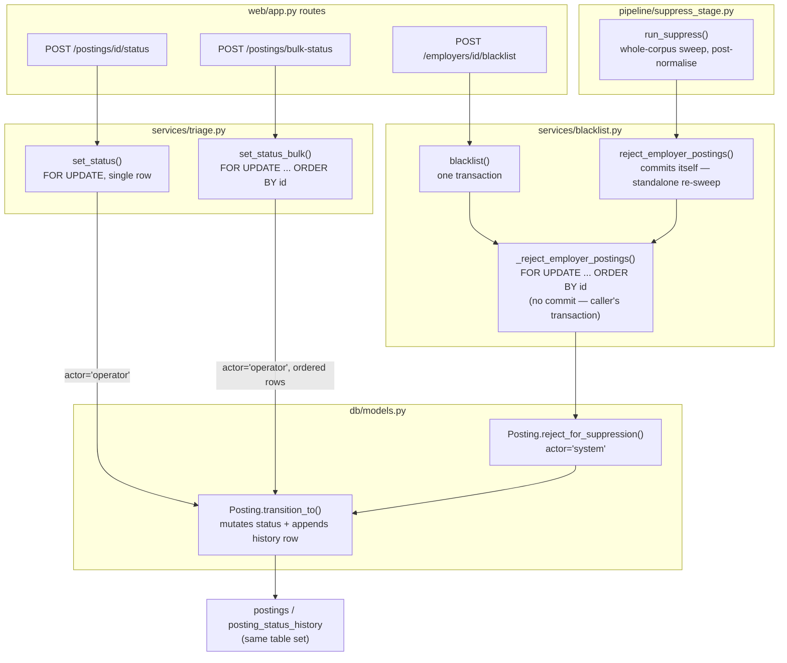
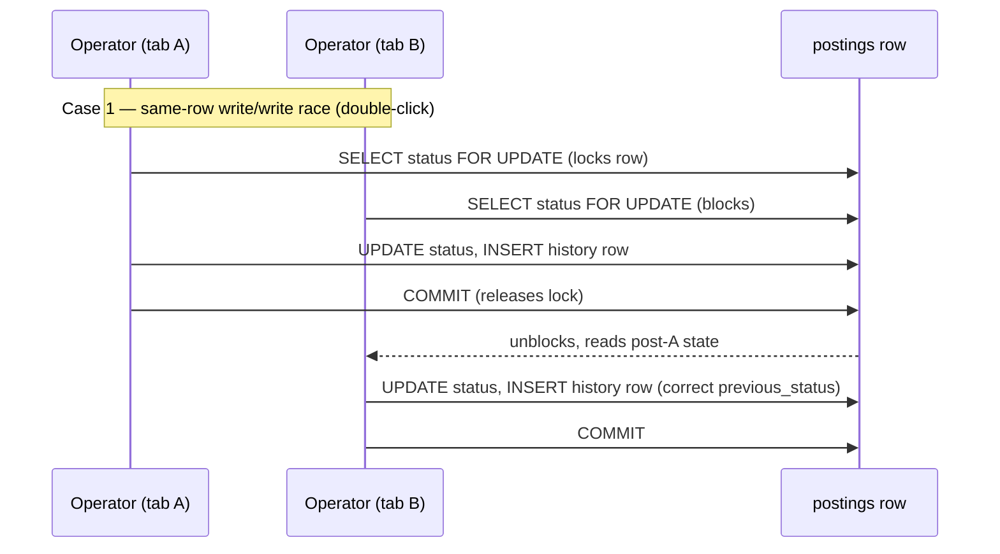
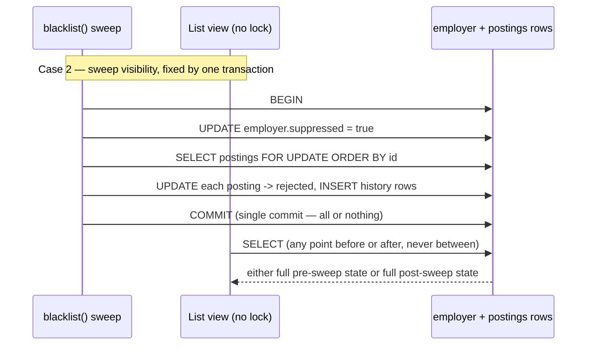
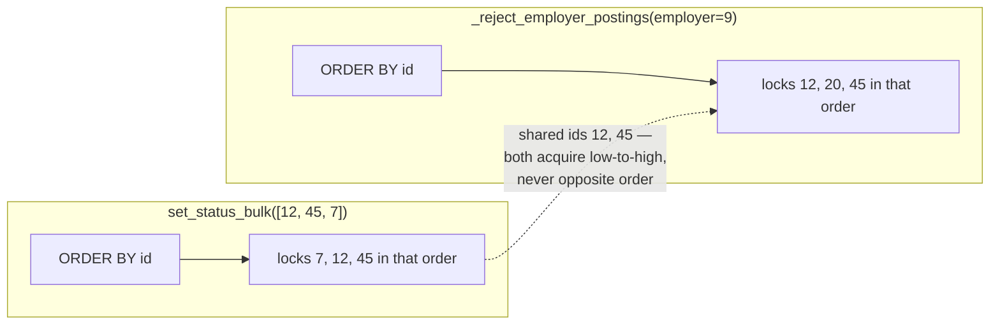

# Design Document — Status Transition Concurrency
## Causal Dependencies Between Triage Services

| | |
|---|---|
| **Version** | 1.0 |
| **Date** | 11 August 2026 |
| **Status** | Draft — **superseded by [ADR-0015](../ADRs/0015-employer-level-suppression.md)** |
| **Related** | [ADR-0012](../ADRs/0012-retrieval-date-column-split.md), [ADR-0013](../ADRs/0013-posting-status-history.md), [ADR-0014](../ADRs/0014-status-transition-row-locking.md), [db/models.py](../../app/src/app/db/models.py), [services/triage.py](../../app/src/app/services/triage.py), [services/blacklist.py](../../app/src/app/services/blacklist.py) |

> **Superseded.** ADR-0015 removes the materialised suppression copy this
> document's sweep-vs-triage sequences analyse — the suppression sweep no
> longer exists, so the races it describes no longer occur. Left unedited
> below as the record of *why* the sweep's atomicity mattered before it was
> removed; do not read the sequence diagrams as current behaviour.

---

## 1. Purpose

ADR-0013 and ADR-0014 each analyze one slice of the concurrency problem
around `Posting.transition_to()` — the history table's transactional
coupling, and the locking/atomicity fix, respectively. Neither shows the
*whole* causal graph: which services call which, which rows each one
touches, and where an unlocked or multi-commit path could leave a reader
looking at a partially-applied change. This document is that consolidated
picture, built by tracing the current (working-tree) state of
`triage.py` and `blacklist.py` against the two ADRs' decisions.

## 2. Symptoms this addresses

1. A suppressed employer's postings could be observed — by the list/detail
   view, or by a concurrent triage request — in a state where
   `employer.suppressed` is already committed but some of that employer's
   postings still read a pre-rejection status.
2. Two writers racing the same posting row (an operator double-click, two
   browser tabs, or a direct `set_status` call landing mid-sweep) could each
   read the same starting `status` and silently overwrite one another,
   producing a `posting_status_history` row whose `previous_status` no
   longer matches what actually happened.
3. Every transition recorded through `triage.py` defaulted to
   `actor="system"`, so the audit trail could not distinguish an operator's
   decision from an automated one — undermining the stated purpose of
   ADR-0013.

## 3. Service call graph

Three services touch `Posting.transition_to()` — the single seam where
`status`, `status_changed_at`, and the `posting_status_history` row are
written together (ADR-0013). None of them call each other directly except
`blacklist()` → `_reject_employer_postings()`; all share the same
underlying table, which is the actual source of the races described above.

## 4. Where the races lived

Both remaining concurrency cases are scoped by ADR-0014 to a
single-operator tool: two operators contending for the *same posting at the
same instant* is explicitly out of scope. What remains in scope is (a) a
single operator's own duplicate request, and (b) the automated suppression
sweep racing a direct write.

The prior implementation split the sweep across two commits
(`employer.blacklist(); session.commit()`, then a second commit inside
`reject_employer_postings()`). Locking rows would not have closed this gap
— `FOR UPDATE` only blocks other **writers**; the list view is a plain read
that takes no lock and would have observed whatever was durable in the
window between the two commits. The fix is a transaction boundary, not a
lock (ADR-0014, Option B rejected for this reason).

## 5. Lock ordering and deadlock avoidance

`set_status_bulk()` and `_reject_employer_postings()` are the two paths
that lock more than one row. Both lock in `id`-ascending order:

Without a shared ordering convention, a bulk triage update touching
postings `[45, 12]` and a suppression sweep touching `[12, 45]` could each
hold one row and block waiting for the other — a deadlock. Ordering both by
`id` ascending removes that possibility structurally.

## 6. Files affected

| File | Role in the graph |
|---|---|
| `app/src/app/db/models.py` | `Posting.transition_to()` — single write seam; `reject_for_suppression()` — `actor='system'` wrapper |
| `app/src/app/services/triage.py` | `set_status()`, `set_status_bulk()` — operator-facing, now `FOR UPDATE` + `actor='operator'` |
| `app/src/app/services/blacklist.py` | `blacklist()`, `_reject_employer_postings()`, `reject_employer_postings()` — one-transaction sweep + standalone re-sweep entry point |
| `app/src/app/pipeline/suppress_stage.py` | `run_suppress()` — whole-corpus sweep calling the same locked, committing `reject_employer_postings()` |
| `Docs/ADRs/0013-posting-status-history.md` | Decision record for the history table and its transactional coupling |
| `Docs/ADRs/0014-status-transition-row-locking.md` | Decision record for locking + the sweep's transaction-boundary fix |

## 7. Current status

The locking and single-transaction fixes described above are implemented in
the working tree (`triage.py`, `blacklist.py`) but not yet committed, and
both ADRs remain "under review." Outstanding before this can be marked
resolved:

- Commit the `triage.py` / `blacklist.py` changes with tests exercising the
  single-commit sweep and the `id`-ascending lock order (shape-only under
  the SQLite test backend, per ADR-0014 §Consequences).
- Move ADR-0013 and ADR-0014 to "Accepted" once merged.
