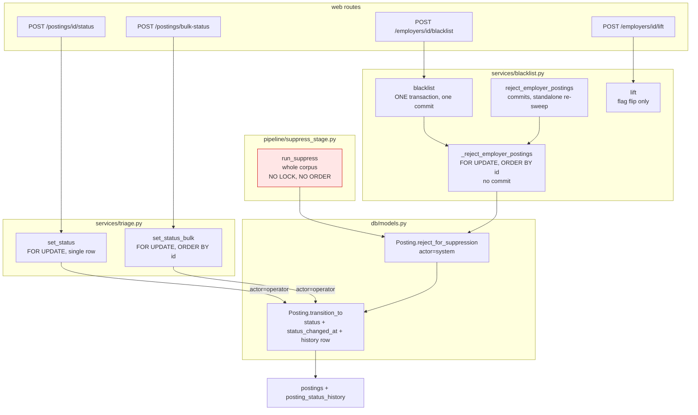
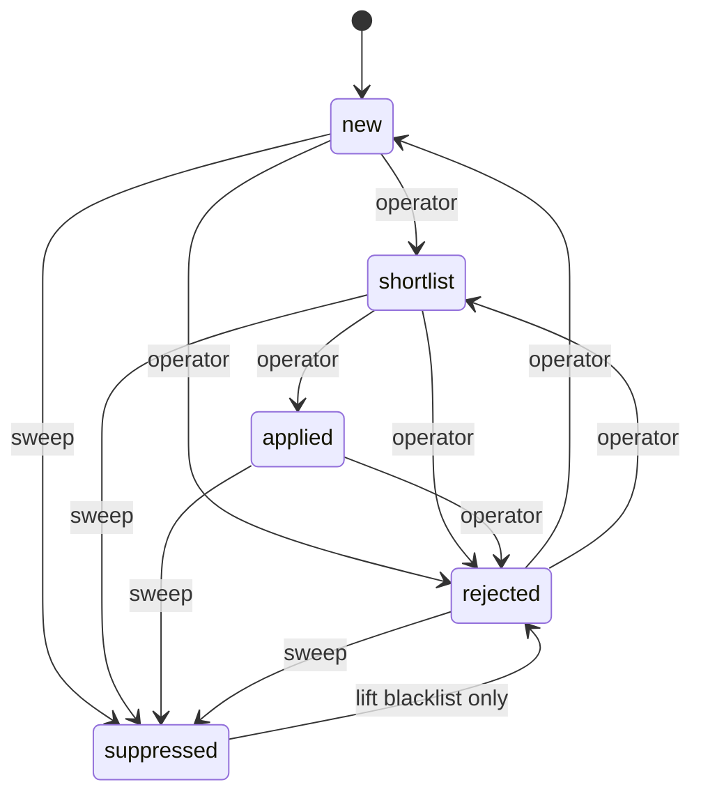

# Design Review — Suppression & Triage Concurrency

| | |
|---|---|
| **Version** | 1.0 |
| **Date** | 11 August 2026 |
| **Status** | Resolved — decision recorded in [ADR-0015](../ADRs/0015-employer-level-suppression.md) |
| **Related** | [ADR-0013](../ADRs/0013-posting-status-history.md), [ADR-0014](../ADRs/0014-status-transition-row-locking.md), [ADR-0015](../ADRs/0015-employer-level-suppression.md), [status-transition-concurrency.md](status-transition-concurrency.md), [db/models.py](../../app/src/app/db/models.py), [services/triage.py](../../app/src/app/services/triage.py), [services/blacklist.py](../../app/src/app/services/blacklist.py), [pipeline/suppress_stage.py](../../app/src/app/pipeline/suppress_stage.py) |

---

## 1. Scope

A working record of the concurrency review of the triage/suppression paths on
branch `job-post-transitions`. It captures the dependency structure, the races
traced, the fixes already implemented, the options weighed but not adopted, and
the questions still open. It is deliberately *not* an ADR — it is the material
from which [ADR-0015](../ADRs/0015-employer-level-suppression.md) was written.

> **Outcome.** The review concluded that every race in §3 is a symptom of one
> modelling decision: `postings.status` holds a *materialised copy* of a fact
> owned by `employers.suppressed`. **ADR-0015 removes the copy** — suppression
> stays on the employer and is derived at read time. `run_suppress` is deleted,
> `blacklist()`/`lift()` become single-row flag flips, and Case B becomes
> structurally impossible. Sections 5.2–5.4 below (the `suppressed` status and
> its guard) are retained as *considered and not adopted* — they are a better
> copy, not the absence of one.
>
> The decision reverses `specs/001-ui-self-service/data-model.md` and restores
> the intent of design record §8.1, which had specified employer suppression as
> a mechanism distinct from posting triage. See §9.

---

## 2. Dependency graph

Three call paths write `Posting.status`. All funnel through the single seam
`Posting.transition_to()`, which mutates `status` + `status_changed_at` and
appends a `PostingStatusHistory` row in the same object graph (ADR-0013).



The red node is the one path that never received the ADR-0014 treatment.

### When each sweep runs

| Sweep | Trigger | Scope | Locked? |
|---|---|---|---|
| `blacklist()` | Operator clicks blacklist — synchronous, in-request | One employer | Yes — `FOR UPDATE`, `id` asc |
| `reject_employer_postings()` | Targeted manual re-sweep | One employer | Yes — `FOR UPDATE`, `id` asc |
| `run_suppress()` | Pipeline stage 3, after collect + normalise — per-profile cron (ADR-0005) and manual `run-all` | Whole corpus | **No** |

The scheduled sweep fires several times daily across profiles, unattended,
while the web UI is live. It is the path most likely to race an operator and
the only one without a lock.

---

## 3. Race conditions explored

### 3.1 Case A — operator commits first

```
Operator: SELECT id=42 FOR UPDATE -> locks
Sweep:    SELECT ... status != rejected FOR UPDATE -> blocks on 42
Operator: UPDATE status=shortlist; INSERT history; COMMIT
Sweep:    unblocks, READ COMMITTED re-checks qual -> still matches -> suppresses
```

**Verdict: correct.** History reads `new → shortlist (operator) → rejected
(system)`. The operator's action is superseded, not lost, and the audit trail
explains why.

### 3.2 Case B — sweep commits first *(the severe one)*

```
Sweep:    locks employer's postings, sets rejected, COMMIT
Operator: SELECT id=42 FOR UPDATE -> unblocks, reads rejected
Operator: UPDATE status=shortlist; COMMIT
```

Mechanically flawless — no lost update, `previous_status` accurate. **But the
business outcome is severe:** the operator silently reverses their own standing
"never show me this employer" instruction and puts the posting back in their
queue, with no signal that anything happened.

The end state is byte-identical to a *deliberate* un-reject, which ADR-0013
explicitly permits. The difference is not in the data but in **informed
consent** — and nothing in the schema distinguishes them.

**Root cause:** every transition asserts a *destination* without asserting a
*starting point*. `set_status(42, 'shortlist')` means "make it shortlist,
whatever it is now", but the operator's intent was "make it shortlist, *given
that it is new*" — the state their screen showed.

### 3.3 The stale-page window

The dangerous interval is not the sweep's runtime. It is the gap between **page
render** and **operator click**, during which the list view is a snapshot that
either sweep can invalidate. That is minutes, not milliseconds.

### 3.4 `run_suppress` corrupts the audit trail

```
Sweep:    plain SELECT reads 42 as 'new'   (no lock)
Operator: FOR UPDATE, writes 'shortlist', COMMIT
Sweep:    flush -> UPDATE postings SET status=... WHERE id=42
```

The ORM emits a **primary-key** predicate, not `WHERE status != ...`, so
READ COMMITTED's post-block re-check passes trivially. The write lands with
`previous_status='new'` when the real previous status was `shortlist`.
**The history table lies** — exactly what ADR-0013 exists to prevent.

Secondary: `run_suppress` takes its implicit UPDATE-time locks in unordered
sequence while `set_status_bulk` locks `id`-ascending, so the two can deadlock —
reintroducing the cycle ADR-0014's ordering convention was written to exclude.

### 3.5 The whole-corpus sweep cannot read intent

`run_suppress` scans the entire corpus rather than the run's delta because it is
a **convergent reconciliation pass**, not an incremental update: it asserts the
invariant unconditionally each run, repairing drift from any cause including
ones not yet enumerated (per the idempotency principle in `CLAUDE.md`).

The cost is that these two states are identical on disk:

- an operator **deliberately** un-rejected a banned employer's posting (permitted), and
- **Case B** silently overwrote a suppression the operator never saw.

So the sweep re-rejects both — silently reverting a deliberate decision on the
next pipeline run. Severity pointed the other way.

---

## 4. Fixes already implemented (working tree, uncommitted)

| Fix | Where | Effect |
|---|---|---|
| Single-transaction blacklist | `blacklist()` — one `commit()` covering the flag flip *and* the rejections | No reader can observe a suppressed employer whose postings have not caught up. Locking could not have fixed this: readers take no lock. |
| `FOR UPDATE` on single-row triage | `set_status` | Second concurrent request blocks, then reads post-transition state |
| `FOR UPDATE ... ORDER BY id` | `set_status_bulk`, `_reject_employer_postings` | Serialises multi-row writers; ascending order makes deadlock structurally impossible |
| `actor="operator"` threading | `set_status`, `set_status_bulk` | History can finally distinguish operator action from the automated sweep |

---

## 5. Options discussed

### 5.1 Rejected

**Absorbing suppression state** — suppression always wins, any transition on a
banned posting eventually reverts to suppressed. *Rejected:* contradicts
"Rejected is not terminal" (ADR-0013); an operator's explicit un-reject could be
silently reverted; "eventually" implies a retry/reconciliation loop that
ADR-0014 deliberately avoided as disproportionate. **Also unnecessary — the
whole-corpus sweep already provides exactly this eventual guarantee.**

**Separate `suppressed` boolean, argued as a concurrency fix** — *Rejected on
that basis.* Row contention is at tuple granularity: under Postgres MVCC an
UPDATE to *any* column writes a new row version and takes the same exclusive
lock, so disjoint columns on the same row still serialise. Adding a status value
or a parallel column changes the string in the `SET` clause and nothing about
the locking. (It survives as a *modelling* option — see §5.3 Option D.)

### 5.2 Adopted in principle — distinct `suppressed` status + guard

A `suppressed` status distinct from `rejected`, which the operator's write
**refuses to overwrite**. Re-tracing:

- **Case A:** unchanged, still correct — operator's action recorded then superseded.
- **Case B: closed.** The operator receives an explicit refusal instead of
  silently overriding.

The guard is sound because it is evaluated *after* `SELECT ... FOR UPDATE` has
taken the row lock — not a TOCTOU check, since nothing can alter `status`
between the comparison and the commit. **The ADR-0014 locking is load-bearing
for the guard.**

Un-rejecting a banned employer's posting stops being per-posting triage and
becomes what it arguably always should have been: **lift the employer's
blacklist**.

### 5.3 Refinement — guard on the employer flag, not the posting status

```python
posting = session.scalar(select(Posting).where(Posting.id == posting_id).with_for_update())
if posting is None:
    return None
# Checked under the lock we already hold (ADR-0014): authoritative, not TOCTOU.
if posting.employer.suppressed:
    raise EmployerSuppressedError(posting_id, employer_id=posting.employer_id)
```

Strictly stronger than checking `posting.status == 'suppressed'`:

- Closes the window where a **newly collected** posting from a banned employer
  briefly reads `new` — `run_normalise` commits before `run_suppress` runs
  within the same pipeline run.
- Avoids the `lift()` trap (§5.4).
- Safe across rows despite locking only the posting: `blacklist()` holds locks
  on all that employer's postings inside its single transaction, so it cannot
  commit while the operator holds the row. A concurrent `lift()` can commit, but
  the worst outcome is a spurious error the operator clears by retrying.

**Resulting invariant:**

> No posting whose employer is currently suppressed may be transitioned by an
> operator. Suppression is exited by lifting the employer's blacklist, never by
> triaging a posting.

### 5.4 The `lift()` trap

FR-011 states that lifting a blacklist does **not** reinstate previously
rejected postings. Today the operator can still recover individual postings by
un-rejecting them by hand. Under a naive `suppressed`-status guard they cannot:
the entire back catalogue freezes permanently, and lifting becomes a no-op for
every posting it originally affected.

Options for exiting suppression:

| Option | Mechanism | Trade |
|---|---|---|
| **A** | Guard on `employer.suppressed`; leave statuses alone | Minimal, no migration, FR-011 literally untouched. But the label goes stale — postings read `suppressed` while the employer is not |
| **B** *(recommended)* | `lift()` transitions `suppressed → rejected` for that employer in one transaction, `actor='operator', reason='blacklist lifted'` | Symmetric with `blacklist()`. Buys the invariant `status == 'suppressed' ⟺ employer.suppressed`, so sweep predicate, UI filter and reports are unambiguous. FR-011 survives in spirit — postings land in `rejected`, not reinstated to active triage, and the operator un-rejects individually |
| **C** | Restore each posting's pre-suppression status from `posting_status_history` | Highest fidelity, and ADR-0013's "Control" section anticipates it. But genuinely violates FR-011 and gets ambiguous across repeated blacklist/lift cycles. Over-engineered here |
| **D** | `postings.suppressed` boolean orthogonal to `status` | Lift is trivially reversible, no triage state lost. But re-splits the single-seam design — "is this posting out of play" becomes a two-field question every read path must remember |

### 5.5 Proposed status model (Option B)



Operator transitions out of `suppressed` are absent by design — the only exit is
lifting the employer's blacklist.

---

## 6. System guarantees to record

To be formalised in `System-modeling.md`. The interesting content is the
**non-guarantees**.

**Safety — nothing bad happens**
- No operator transition on a posting whose employer is currently suppressed.
- Every `status` change has exactly one history row, written in the same transaction.
- No reader observes a partially-applied blacklist sweep.
- Invalid statuses produce zero side effects — validation precedes mutation.

**Liveness — something good eventually happens**
- Every posting of a suppressed employer eventually reaches `suppressed`, via the
  whole-corpus reconciliation pass. Bounded by the next pipeline run, **not immediate**.

**Explicitly not guaranteed**
- The operator's rendered page has no bounded staleness — this is precisely why the guard exists.
- No read-your-writes across separate requests.
- Lock waits have no timeout (accepted, ADR-0014).
- SQLite tests exercise lock *shape*, never real blocking.
- "Eventually suppressed" is per-pipeline-run: a posting can sit non-suppressed for hours.

The staleness and eventual-consistency properties must be **surfaced in the UI**,
alongside the guard's refusal message.

---

## 6b. Root cause

The symptoms in §3 and the options in §5 all address the same underlying
defect. `postings.status` conflates two independent facts with different
owners:

| Fact | Owner | Nature |
|---|---|---|
| "What does the operator think of this posting?" | Operator | Primary — exists nowhere else |
| "Is this posting's employer blacklisted?" | System | **Derived** from `employers.suppressed` |

The second is a copy. Two copies of one fact, in two tables, that can disagree
— and every piece of machinery under review exists to keep them agreed:

- **Sweeps exist at all** because a materialised copy must be propagated
  (`blacklist()`) and repaired when it drifts (`run_suppress`).
- **The sweep needs transactional atomicity** because propagating to N rows
  alongside the flag flip is a multi-row write a reader can catch half-applied.
- **Case B is possible** because operator and system write the same column.
  They are not contending over a posting; they are contending over *a column
  that means two things*.
- **The `lift()` trap exists** because the propagation is destructive — it
  overwrites the operator's judgement, so there is no inverse.
- **Intent is unrecoverable** because both writers leave identical traces.

**Origin.** This was not the original design. `job-discovery-pipeline-design.md`
§8.1 (D15) states that "Employer-level suppression remains distinct, since it
must exclude every posting from that employer including ones not yet seen" —
which is precisely the argument that it cannot be a per-posting fact. The
materialisation was introduced later by
`specs/001-ui-self-service/data-model.md` to avoid changing any read path, and
no ADR recorded the reversal. Its stated "no schema change" rationale does not
hold: deriving needs *zero* new columns, since `employers.suppressed` already
existed and was "read nowhere."

The irony: §8.1's own reason for keeping the mechanisms distinct — suppression
must cover postings *not yet seen* — is exactly why `run_suppress` must exist.
A materialised flag can only apply to rows that exist, so something must run
after every collection to catch up.

## 7. Questions closed by ADR-0015

| # | Question | Resolution |
|---|---|---|
| 1 | Does `run_suppress` get `FOR UPDATE`? | **Moot** — the file is deleted. No materialised copy, no reconciliation pass |
| 2 | Which lift option — A, B, C or D? | **None of them.** All four presuppose a per-posting copy. `lift()` becomes a flag flip; postings return with their operator status intact |
| 3 | Does FR-011 need rewording? | **Yes.** It becomes a display decision, not a data-destruction one. SRS update required — ADR-0015 does not silently redefine it |
| 4 | Migration for existing `rejected` rows | **Deliberate no-op.** Intent is unrecoverable (the ADR-0013 backfill writes `previous_status = NULL`), and those postings are already hidden. Schema-only migration, no data rewrite |
| 5 | Scope of the guard on `set_status_bulk` | **Moot** — no guard needed. Operator and system no longer write the same field |
| 6 | `blacklist()` reads the employer without `FOR UPDATE` | **Moot** — `blacklist()` is now a single-row flag flip |
| 7 | Should `Posting.create` check `employer.suppressed`? | **No.** A posting collected from a blacklisted employer is filtered the day it appears, with nothing needing to run |
| 8 | ADR-0013 / ADR-0014 still "under review" | Still open — see §8 |

### Still open

- **The read-path seam.** Every read must go through the filtered base query.
  Forgetting it silently resurfaces a blacklisted employer — the failure mode
  moves from "stale data" to "missing filter." Where exactly it lives (base
  query helper, relationship, or database view) is an implementation decision.
- **Historical/future asymmetry on lift.** Postings suppressed before this
  change stay rejected after a lift; postings suppressed after it reappear.
  Accepted in ADR-0015, but worth surfacing in the UI.
- **ADR-0013 and ADR-0014 are both still "under review"**, and the §4 fixes are
  uncommitted.

---

## 8. Next steps

- [x] Commit the §4 working-tree fixes — the `set_status` / `set_status_bulk`
  locking and `actor="operator"` threading survive ADR-0015 unchanged.
- [x] Implement ADR-0015: delete `pipeline/suppress_stage.py`, reduce `blacklist()`
  and `lift()` to flag flips, remove `_reject_employer_postings` /
  `reject_employer_postings`, and route every read path through one filtered seam.
- [x] Update `specs/001-ui-self-service/data-model.md` and FR-011 in the SRS to
  match — the reversal must be recorded, not left as drift.
- [x] Draft `System-modeling.md` from §6, revised for the derived model: the
  liveness property ("eventually suppressed") is replaced by a safety property
  ("never visible"), since nothing has to converge any more.
- [x] Move ADR-0013 to *Accepted*; mark ADR-0014 *partly superseded by ADR-0015*.

All items complete — see
[002-employer-suppression-derived](../../specs/002-employer-suppression-derived/spec.md)
for the implemented feature.
