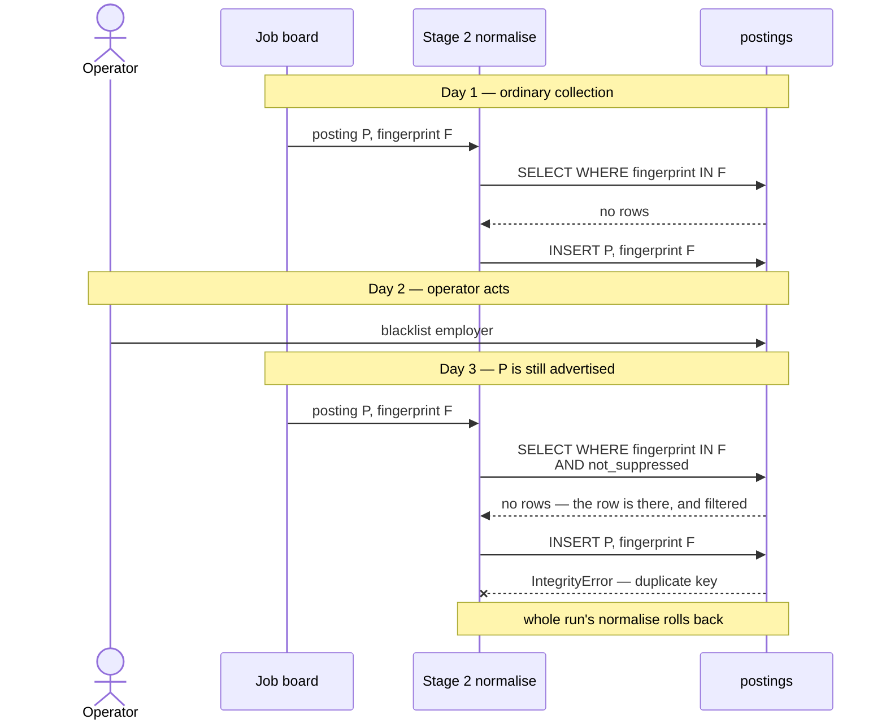
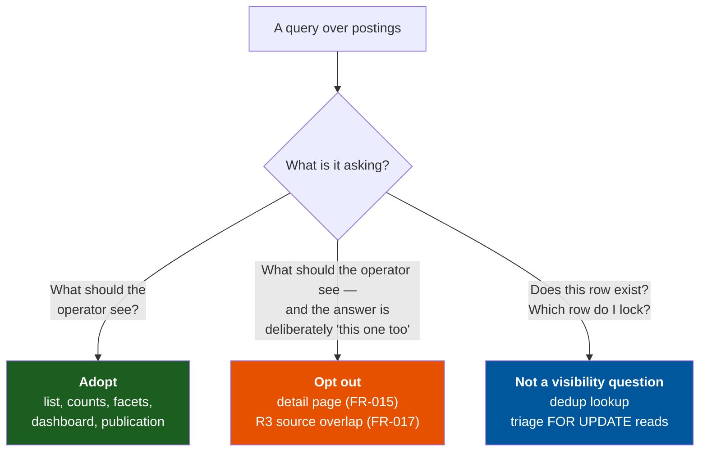

# The suppression seam and the stage-2 dedup lookup

| | |
|---|---|
| **Version** | 1.0 |
| **Date** | 13 August 2026 |
| **Status** | Analysis — informs [ADR-0015](../ADRs/0015-employer-level-suppression.md) implementation |
| **Subject** | `app/src/app/pipeline/normalise_stage.py:62-68` |
| **Related** | [ADR-0015](../ADRs/0015-employer-level-suppression.md), [implementation plan](IMPLEMENTATION_PLAN_ADR-0015-Employer-level.md), [read-path inventory](../../specs/002-employer-suppression-derived/contracts/read-path-inventory.md) |

---

## 1. Summary

ADR-0015 replaces materialised suppression with a read-time filter and states the
obligation plainly: **every read of `postings` applies the suppression predicate,
or records why it does not.** The stage-2 deduplication lookup is a read of
`postings` that must *not* apply it. If it does, the daily pipeline breaks —
not subtly, and not only for the blacklisted employer.

The lookup is currently absent from the read-path inventory, which means it is
neither an adoption nor a recorded exemption. It is the one state the inventory
exists to make impossible: unexamined.

This document sets out the mechanism, the blast radius, why the mistake is an
easy one to make, and what distinction the codebase needs in order to stop
making it.

---

## 2. The path

`run_normalise` folds a run's raw rows into deduplicated postings. To avoid a
query per row — roughly 200 round trips on a typical run, per
`refactor-plan.md` §4.3 — it fingerprints everything up front and resolves the
whole batch in one statement:

```python
digests = {parts.digest for _, parts, _ in parsed}
postings_by_fingerprint = {
    p.fingerprint: p
    for p in session.scalars(select(Posting).where(Posting.fingerprint.in_(digests)))
}
```

That dictionary is the sole input to the branch that decides whether a raw row is
a *re-observation* of a known role or a *new* one:

```python
posting = postings_by_fingerprint.get(parts.digest)
if posting is None:
    posting = Posting.create(fingerprint=parts.digest, ...)
    session.add(posting)
else:
    posting.observe(site=raw.site, ...)
```

`Posting.fingerprint` is declared `unique=True` — it is the column the entire
deduplication design rests on.

---

## 3. What happens today

```mermaid
flowchart TD
    A["Raw rows for this run"] --> B["Fingerprint every row"]
    B --> C["Batch lookup:<br/>SELECT Posting WHERE fingerprint IN digests"]
    C --> D{"Fingerprint<br/>already in postings?"}
    D -->|yes| E["observe&#40;&#41; — merge provenance,<br/>backfill description"]
    D -->|no| F["Posting.create&#40;&#41; — insert a new row"]
    E --> G["session.commit&#40;&#41;"]
    F --> G
    G --> H["Run recorded"]

    style H fill:#1b5e20,color:#fff
```



A blacklisted employer's posting is found like any other, because the lookup asks
only whether the fingerprint exists. Suppression is irrelevant to that question,
and today nothing makes it relevant.

---

## 4. What happens if the seam is applied

```mermaid
flowchart TD
    A["Raw rows for this run"] --> B["Fingerprint every row"]
    B --> C["Batch lookup<br/>+ not_suppressed&#40;&#41;"]
    C --> D{"Fingerprint<br/>returned?"}
    D -->|"employer not blacklisted"| E["observe&#40;&#41;"]
    D -->|"employer blacklisted —<br/>row exists but is filtered away"| F["Posting.create&#40;&#41;<br/>with a fingerprint<br/>already on disk"]
    E --> G["session.commit&#40;&#41;"]
    F --> G
    G --> H{"UNIQUE constraint on<br/>postings.fingerprint"}
    H -->|violated| I["IntegrityError"]
    I --> J["Entire run's normalise<br/>rolls back"]

    style I fill:#b71c1c,color:#fff
    style J fill:#b71c1c,color:#fff
```



The filter cannot make the row on disk go away. It only makes stage 2 *unable to
see it* — and stage 2 interprets "cannot see it" as "does not exist", which is
the one interpretation that is now false.

### The timeline

The failure is cross-run. It needs a posting that existed **before** the
blacklist and is **still listed** on the board afterwards — which is the ordinary
case, since blacklisting an employer does nothing to stop that employer
advertising.



---

## 5. Blast radius

There is **no per-row flush**. `session.add(posting)` accumulates, and stage 2
commits once, at the end:

```python
run.deduplicated_count = len(touched)
session.commit()          # ← the only commit in run_normalise
```

So the `IntegrityError` does not fail one posting. It fails the commit, and the
transaction carries every posting from every employer in that run, plus
`run.deduplicated_count` and every `observe()` merge performed along the way.

**One blacklisted employer with one still-live advertisement silently takes down
the whole day's normalisation** — including postings from employers the operator
cares about, which is the part that makes this more than a cosmetic defect. The
traceback names a fingerprint collision, so the investigation starts at the
deduplication logic, several layers from the actual cause.

It then recurs every single day, because the condition that triggers it is
permanent: the blacklist is not going away, and neither is the advertisement.

---

## 6. Why the mistake is an easy one to make

Four things point a well-intentioned developer straight at it.

**The obligation is stated in the strongest possible terms, on purpose.**
ADR-0015 accepts that centralising the filter *relocates* the risk rather than
removing it: the failure mode becomes "a read path forgot the filter", and a
forgotten filter resurfaces a blacklisted employer. Every artefact in the feature
therefore pushes toward applying it — the seam's own docstring says "if you are
writing a query over postings and not using it, that is a decision to be
justified in a comment, not an omission." Correctly applied to lists and counts.
Catastrophic here.

**`pipeline/` is precisely where the ADR says the seam's consumers live.**
Stage 3 (scoring) and stage 4 (publication) are named as adopters, and siting the
seam in `db/` rather than `services/` was justified *specifically* so `pipeline/`
modules could reach it. A developer arriving in `pipeline/normalise_stage.py`
finds a query over `postings` in exactly the package that has been told to adopt.

**The read-path inventory currently offers no counterexample.** It lists eighteen
paths, none from `pipeline/`. A developer consulting it to learn the convention
sees adoption in `services/`, two product-motivated opt-outs, and two
not-yet-built `pipeline/` stages marked *must adopt*. Nothing in the table
suggests a `pipeline/` read could be the wrong place to filter.

**The obvious test would pass.** Line 118 caches the newly created posting in the
same dictionary:

```python
session.add(posting)
postings_by_fingerprint[parts.digest] = posting
```

A test that collects the same posting twice *within one run* therefore finds the
in-memory entry on the second row and never touches the database. The collision
only occurs against rows written by an **earlier** run. A naive regression test —
"blacklist an employer, collect their posting twice, assert no duplicate" — is
green. Reproducing the bug requires two separate `run_normalise` calls with a
blacklist applied between them, which is not the shape a test naturally takes.

---

## 7. The distinction the codebase is missing

The three read paths that decline the seam decline it for two entirely different
reasons, and the inventory currently has vocabulary for only one.



The middle class is a **product decision**: the operator *should* see this, and
an FR says so. The detail page is the operator's route back out of a suppression;
R3 measures collector coverage, so filtering would make it answer a different
question than its title claims. Both are arguable, and both were argued.

The right-hand class is a **category error**, not a trade-off. The dedup lookup
does not ask what the operator should see. It asks whether a row exists — and
existence is not a function of visibility. Applying a visibility filter to an
existence check is not a defensible position that lost on balance; it is a
malformed question.

Collapsing the two classes into one "opt-out" bucket is what makes the dedup
lookup look like a borderline judgement call. It is not borderline. Naming the
third class is what stops the next developer from treating it as one.

The same reasoning covers `triage.set_status` and `set_status_bulk`, which read
`SELECT … FOR UPDATE` to locate a row for mutation. They ask *which row do I
lock*, not *what should be shown*. Worth recording, because the answer is a small
result of ADR-0015 in its own right: an operator can triage a suppressed posting
harmlessly, since `status` is theirs alone and suppression is now an orthogonal
axis. Under the materialised model that was a race with the sweep; under
derivation it is a non-event.

---

## 8. Fix

Three edits. All are documentation — **no behaviour changes**, because the
current behaviour is correct. What is missing is the record of *why* it is
correct, which is the only thing standing between it and a future "fix".

**8.1 — Add a third verdict class to the read-path inventory.** Adopt / Opt out /
Not a visibility question, per §7. Add rows for the dedup lookup
(`normalise_stage.py:62-68`) and both `triage.py` reads (`:37`, `:60`) under the
third class, each with its reason.

**8.2 — Comment the lookup at the site**, in the house style — comments explain
*why* and cite the decision they implement:

```python
# Deliberately not filtered by db.visibility.not_suppressed() (ADR-0015): this
# asks whether a row exists, not whether an operator should see it. Filtering
# would hide a suppressed employer's existing posting from dedup, sending the
# re-collection down the create branch and colliding on the unique fingerprint —
# which fails the single end-of-run commit and rolls back the whole run.
```

The comment names the *consequence*, not just the intent. A reader who knows only
that the omission is deliberate may still decide the deliberation was wrong; a
reader who knows it takes down the daily run will not.

**8.3 — Narrow nothing in FR-010.** The obligation should keep reading "every path
that reads postings", because an obligation that excludes paths by definition
recreates the silent gap it exists to prevent. The third verdict class keeps the
inventory complete *and* keeps the two kinds of decline distinguishable.

### Not recommended: a regression test

Tempting, but it would assert the absence of a filter nobody has written. It
would pass today, pass tomorrow, and fail only in the same commit that introduces
the bug — by which point the comment at 8.2 has already been read and overruled.
The commit-time defence is the comment; the design-time defence is the inventory
row. A test here mostly encodes the shape of a mistake rather than a requirement.

---

## 9. Control

The invariant worth carrying forward, alongside ADR-0015 §Control's own:

> **Suppression answers "what should the operator see". It never answers "what
> exists".** A query that asks the second question and applies the visibility
> filter is asking the wrong question, not making a different trade-off.

Stage 3 and stage 4 both adopt the seam — they select postings *to act on*, which
is a visibility question in the same sense the list is. But any future batch
lookup, existence check, uniqueness probe, or lock-acquisition read belongs in the
third class, and should say so at the site.
