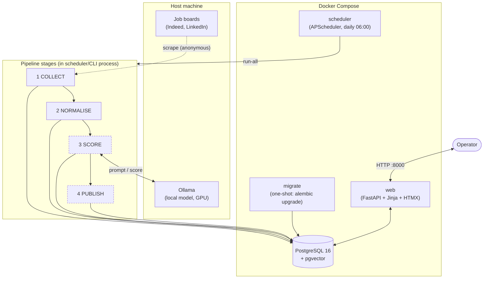
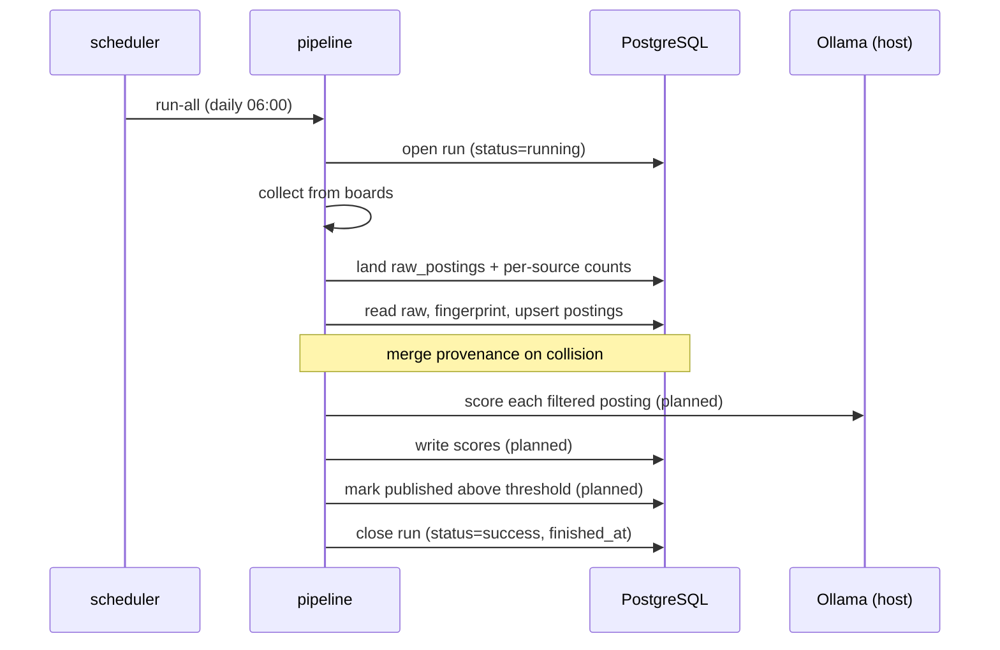

# Design Document — System Architecture
## Automated Job Discovery Pipeline

| | |
|---|---|
| **Version** | 1.0 |
| **Date** | 21 July 2026 |
| **Status** | Approved |
| **Related** | [SRS](../software-requirements-specification.md), [Data Model](data-model.md), [Design record](../job-discovery-pipeline-design.md) |

---

## 1. Overview

The system is a four-stage pipeline executed once daily, with a web interface
over the resulting data. Stages communicate only through a PostgreSQL staging
database; none calls another directly. Each stage is independently re-runnable
and idempotent, and data flows in one direction (design §7.1).

The staging database is the central design decision. It establishes an
idempotency boundary with three consequences (design §7.2):

1. A failure in a later stage does not cost an earlier stage's work.
2. Scoring can be re-run across the whole corpus after a prompt change without
   re-collecting.
3. Rejected postings persist, preventing recurrence.

---

## 2. Component view

Stages 3 and 4 (dashed) are specified but not yet implemented.

---

## 3. Runtime topology

The system runs as four containers from one image plus the stock PostgreSQL
image (ADR-0004, tech-stack T2).

| Service | Image | Lifetime | Role |
|---|---|---|---|
| `postgres` | `pgvector/pgvector:pg16` | Long-running | Staging database and durable store |
| `migrate` | `job-discovery:latest` | One-shot | Applies migrations to head, then exits |
| `scheduler` | `job-discovery:latest` | Long-running | Fires `run-all` daily |
| `web` | `job-discovery:latest` | Long-running | Serves the triage interface |

Startup ordering is enforced by Compose: `postgres` must be healthy, then
`migrate` must exit successfully, before `web` and `scheduler` start. This
removes the race in which two long-running services might apply migrations
concurrently.

**Ollama runs on the host, not in a container**, so it can use the host GPU
directly. The application containers reach it at `host.docker.internal:11434`.

---

## 4. Package structure

The application is one Python package, `app`, organised by responsibility.

| Package | Responsibility | Depends on |
|---|---|---|
| `app.config` | Typed settings from environment/`.env` | — |
| `app.collect` | Stage 1: query boards via JobSpy | JobSpy |
| `app.normalise` | Fingerprinting: country, employer, title | JobSpy (country enum) |
| `app.db` | SQLAlchemy models and session management | SQLAlchemy |
| `app.pipeline` | Stage orchestration and persistence | `collect`, `normalise`, `db` |
| `app.web` | FastAPI interface | `db`, FastAPI |
| `app.scheduler` | APScheduler daily trigger | APScheduler |
| `app.__main__` | Typer CLI wiring the above together | all |

The dependency direction is strict: `normalise` and `collect` know nothing of
the database; `pipeline` composes them and persists; `web` reads the database
only. Fingerprint logic is pure functions over strings, testable without any
infrastructure.

---

## 5. Stage design

### 5.1 Stage 1 — Collect

Queries each configured board for each search specification through JobSpy.
Search specifications are explicit rather than a term × location product, because
JobSpy's `country_indeed` parameter takes one country per call (design D14).

A board failing raises no exception out of the stage: the error is recorded
against the run and the remaining boards proceed (SRS FR-4). The complete
collector output is landed verbatim in `raw_postings`; no field is discarded at
this stage, so a later schema decision costs a backfill rather than a
re-collection.

A subtle failure shape is handled explicitly: a total board failure returns a
DataFrame with no columns (shape `(0,0)`), not merely no rows. The stage checks
for emptiness before touching columns, converting a would-be crash into a
recorded empty result.

### 5.2 Stage 2 — Normalise

Reads the run's landed rows, derives a fingerprint per row, and upserts one
`postings` record per fingerprint. The fingerprint is
`sha256(normalised_employer | normalised_title | location_token)`, where the
location token is the ISO country code, `REMOTE`, or `UNKNOWN`.

Where several boards surface the same role, each board's URL is merged into the
posting's `sources` map rather than creating a second record. The stage is
idempotent: reprocessing the same rows converges on the same postings.

The normalisation rules trade a tolerable failure for an intolerable one
throughout (design §7.3): showing one posting twice is a nuisance; concealing a
posting behind a false merge is a lost opportunity. Employer normalisation is
therefore conservative (suffixes only), title normalisation retains
seniority/discipline, and an unresolvable country becomes `UNKNOWN` rather than a
guess.

### 5.3 Stage 3 — Score **(planned)**

Applies a coarse regular-expression title filter to reduce model invocations
(design D6), then scores each surviving posting against the CV through a locally
hosted instruction-tuned model via Ollama. Output — score, matched skills, gaps,
rationale — is validated against a Pydantic schema before storage; malformed
output is rejected. The producing model is recorded with the score.

**Seam obligation (ADR-0015):** the candidate query must apply
`db.visibility.not_suppressed()` when selecting postings to score, and the
scored-count written to `runs` must be scoped the same way. Scoring a
blacklisted employer's postings is wasted model time.

### 5.4 Stage 4 — Publish **(planned)**

Marks postings at or above the threshold as published, which is what surfaces
them in the interface. After ADR-0004 this is a database state transition, not a
write to any external service.

**Seam obligation (ADR-0015):** this is where FR-009 (a blacklisted employer's
postings are never published) now lives. `db.visibility.not_suppressed()`
must be applied both when selecting candidates for publication and when
writing `run.published_count` — nothing else in the pipeline excludes a
suppressed employer's postings from this stage.

---

## 6. Interface design

The web interface is server-rendered (FastAPI + Jinja2), with HTMX for the status
transition so a triage action does not reload the page. It has no build step and
shares the application image and the same Python runtime as the pipeline
(tech-stack T2).

| Route | Purpose |
|---|---|
| `GET /` | Overview: totals, triage breakdown, source-health sparklines |
| `GET /postings` | Ranked, filterable, searchable list |
| `GET /postings/{id}` | Detail: description beside assessment; source links |
| `POST /postings/{id}/status` | Triage transition (HTMX fragment, or redirect without) |
| `GET /runs` | Per-source trend and run history (the §7.4 review surface) |
| `GET /healthz` | Liveness plus database reachability |

Read models live in `app.web.queries`, separate from the route handlers, so the
querying is testable without a web client and templates receive plain data rather
than ORM rows.

Status transitions degrade gracefully: the control posts a normal form when HTMX
is absent, and the endpoint redirects rather than returning a bare fragment when
the request is not an HTMX request.

---

## 7. Data flow and idempotency

Idempotency is enforced per stage: collection appends to an append-only landing
zone keyed by run; normalisation upserts by fingerprint; scoring and publication
are keyed by posting. A crash leaves the run at `running`, which is itself the
signal that the process died (SRS FR-32).

---

## 8. Observability

Per-run, per-stage counts are persisted to the `runs` table, and per-source
counts to `runs.counts_by_site`. The dominant failure mode is not an error but a
run that exits successfully while a source silently returns less over time. The
aggregate collected count hides this; the per-source series exposes it. The
interface renders that series as the primary content of the overview and runs
views, and weekly review of it is a required operating procedure (Operations
Guide §4).

---

## 9. Technology summary

| Concern | Choice | Reference |
|---|---|---|
| Language / runtime | Python 3.12 | tech-stack |
| Dependency management | uv (locked) | tech-stack T3 |
| Collection | JobSpy | D2 |
| Store | PostgreSQL 16 + pgvector | D4 |
| ORM / migrations | SQLAlchemy 2.0 / Alembic | T1 |
| Scoring | Ollama, 7–8B instruction model | D5, D8 |
| Interface | FastAPI + Jinja2 + HTMX | ADR-0004 |
| Scheduling | APScheduler (in container) | T2 |
| Packaging | One image, four services | ADR-0004 |

---

## 10. Known constraints and future work

- **Vector search** is provisioned but unused: the pgvector extension is enabled
  in the initial migration though no column requires it yet, to avoid a migration
  whose only purpose is the extension (design §14, phase 2).
- **Single machine.** There is no horizontal scaling story and none is required.
- **Cross-board deduplication** is proven on live data but has been exercised on
  only a small volume; its behaviour at scale accrues as the corpus grows.

*End of document.*
