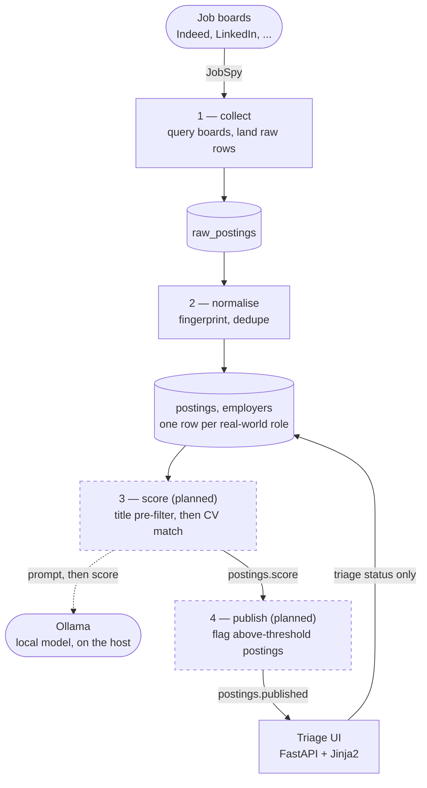
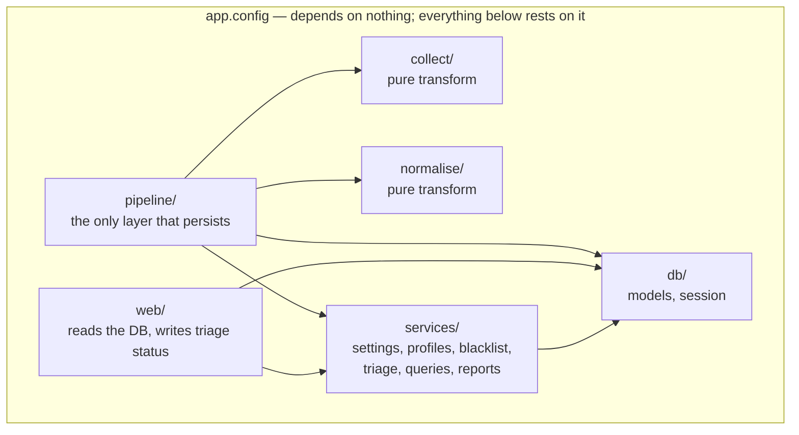

# Automated Job Discovery Pipeline

Collects job postings from multiple boards, deduplicates them into one record
per real-world role, scores them against a CV using a locally hosted model, and
presents the ranked results in a local web interface for triage.

**No data leaves the machine, and there is no recurring cost.** Everything runs
on the operator's own hardware: PostgreSQL in a container, scoring through
[Ollama](https://ollama.com/) on the host, and a FastAPI interface bound to
localhost. There is no SaaS account, no API key, and no third party holding the
CV or the search history.

---

## The problem

Searching several job boards by hand produces the same posting several times
over, in slightly different words. The same role appears as *Senior Data
Engineer* on one board and *Sr. Data Engineer (Remote)* on another; the same
city appears as `Cairo, Egypt` and as `القاهرة, C, EG`. Deduplicating that by
eye is the tedious part, and it is the part that hides postings — two variants
of one role look like two opportunities, while a genuinely different role gets
skimmed past because it looks like one already seen.

This pipeline does the collection and the deduplication mechanically, then
ranks what survives against an actual CV so the reading order is worth
something.

### The governing constraint

Deduplication is asymmetric, and the whole design turns on it:

> **A false merge conceals a posting. A false split merely repeats one.**

Missing a job because two distinct roles were collapsed into one record is a
real loss. Seeing the same role twice is an annoyance. Every fingerprinting
rule is therefore biased toward *splitting* when uncertain, and the test suite
asserts non-merging at least as hard as it asserts merging. Contributors are
expected to preserve this — see [CONTRIBUTING.md](CONTRIBUTING.md).

---

## Status

| Stage | What it does | State |
|---|---|---|
| 1 — Collect | Query boards via JobSpy, land raw postings | **Implemented** |
| 2 — Normalise | Fingerprint and deduplicate into one record per role | **Implemented** |
| 3 — Score | Title pre-filter, then score against the CV via Ollama | Specified, not built |
| 4 — Publish | Mark above-threshold postings for review | Specified, not built |
| Triage UI | FastAPI interface for reviewing and acting on results | **Implemented** |

Stages 3 and 4 are fully specified in the design record and the SRS; the CLI
subcommands exist and report that they are unimplemented. Documents describing
unbuilt behaviour are marked **(planned)**.

---

## Architecture

Four stages run in order, each independently invocable against stored data, and
each idempotent — re-running against the same input converges on the same state.



Stages 3 and 4 write columns on `postings` (`score`, `scored_by_model`,
`published`) rather than tables of their own, so scoring a posting again
overwrites rather than accumulates. Each run records its per-stage counts in
`runs`, which is what `status` reads back.

### Dependency direction

This is strict, load-bearing, and enforced in review. An arrow means *imports*:



Note what is absent: nothing points *into* `collect/` or `normalise/` except
`pipeline/`, and neither of them points at `db/`.

Every module in the box also imports `config.py` directly — that fan-in is
omitted above since it would just be an edge from every box to one, and it
adds nothing past the label. The one exception is `config.py` itself:
`RunConfig.resolve()` imports `services/settings.py` inside the function body
(not at module scope) so it can read the database before falling back to
environment or code default (ADR-0005). The local import is what keeps that
from being a real cycle — it's deliberate, and the comment at
[config.py:126](app/src/app/config.py#L126) says so.

- **`config.py` depends on nothing; everything depends on it.** Never read
  `os.environ` directly anywhere else — add a field to `Settings` instead.
- **`collect/` and `normalise/` know nothing of the database.** They are pure
  transforms, testable without any infrastructure. This is what makes the
  fingerprint logic trivially testable, and it is lost the moment normalisation
  imports a session.
- **`pipeline/` is the only layer that persists.** It composes `collect` and
  `normalise` and writes the results.
- **`web/` reads the database and never writes pipeline data** — only triage
  status.

If a change requires violating one of these, that is a design discussion (and
probably an ADR), not a refactor to slip into a feature PR.

---

## Repository structure

The Python project is nested under `app/`; the repository root holds
documentation and specifications.

```
Automatic-Job-search/
├── README.md                  This file — the front door
├── CONTRIBUTING.md            Conventions, review rules, the ADR and spec process
├── SECURITY.md                Reporting, and this project's actual attack surface
├── NOTICE.md                  Scraping, terms of service, and personal data
├── .trufflehog/               Secret-scanning config and path filters
├── .github/workflows/         CI and secret scanning
│
├── Docs/                      Design record, SRS, architecture, guides, ADRs
│   └── README.md              ← start here for the reasoning behind a decision
│
├── specs/                     Per-feature specifications (spec-kit numbering)
│   └── NNN-slug/              spec.md, plan.md, tasks.md, research.md
│
└── app/                       ★ The Python project — run commands from here
    ├── pyproject.toml         Dependencies and tool config (uv)
    ├── docker-compose.yml     postgres, migrate, web, scheduler
    ├── migrations/            Alembic
    ├── src/app/
    │   ├── __main__.py        Typer CLI — the single entry point
    │   ├── config.py          Typed settings; the one source of truth
    │   ├── collect/           Stage 1 — JobSpy
    │   ├── normalise/         Fingerprinting (country, employer, title)
    │   ├── pipeline/          Orchestration + persistence
    │   ├── db/                SQLAlchemy models and session
    │   ├── services/          Shared service-layer logic
    │   └── web/               FastAPI triage interface
    └── tests/                 pytest — runs with no Docker and no services
```

**`Docs/` is reasoning; `specs/` is planned work.** `Docs/` holds durable
records — why the system is shaped as it is, what it must do, and the ADRs that
fix individual decisions. `specs/NNN-slug/` holds the working specification for
one feature under development, and its directory name matches the branch name.

---

## Quick start

Requires [uv](https://docs.astral.sh/uv/), Docker, and — for stage 3 — Ollama on
the host. Python 3.12 is pinned by `app/.python-version` and installed by uv.

**All commands run from `app/`.**

```bash
cd app
cp .env.example .env          # then edit; see the table in the deployment guide
docker compose up -d          # postgres, migrate, web, scheduler
```

Then open <http://localhost:8000>.

For development against a host-side environment:

```bash
cd app
uv sync                          # create .venv from the locked graph
docker compose up -d postgres    # just the database
uv run python -m app web --reload
```

### Everyday commands

```bash
uv run pytest                       # full suite — no Docker required
uv run pytest tests/test_fingerprint.py
uv run ruff check src tests         # lint
uv run ruff format src tests        # format
uv run python -m app --help         # every stage is a subcommand
```

The CLI is the single entry point, so any stage can run independently against
stored data:

| Command | Does |
|---|---|
| `collect` | Stage 1 — collect and land raw postings |
| `normalise [--run-id N]` | Stage 2 — fingerprint and deduplicate |
| `score` | Stage 3 — title filter and model scoring *(planned)* |
| `publish` | Stage 4 — mark above-threshold published *(planned)* |
| `run-all` | Every stage in order, recording per-stage counts |
| `serve` | Run the scheduler in the foreground |
| `web` | Serve the triage interface |
| `status` | Recent runs and their per-stage counts |
| `config` | Print effective configuration, secrets masked |

---

## Configuration

Configuration resolves in the order **database → environment/`.env` → code
default** (ADR-0005). The operational settings — searches, thresholds, filters,
delays — are edited in the web UI and stored in the database; the values in
`.env` seed the first migration and act as the fallback for a fresh deployment.
Editing `.env` after the first run has no effect.

> **The shipped defaults are one person's job search.** `SEARCHES` looks for
> data engineering roles in Cairo and `TIMEZONE` is `Africa/Cairo`. These are
> seed values, meant to be replaced on first run from the Schedules and Settings
> pages — they are examples of the shape a search takes, not a statement of what
> the project is for. Change them to your own before the first collection run.

---

## Documentation

The full documentation set lives in **[Docs/](Docs/)** — start with
[Docs/README.md](Docs/README.md), which indexes it and gives a reading order.

| Document | Read it for |
|---|---|
| [Design record](Docs/job-discovery-pipeline-design.md) | Why the system is shaped this way |
| [SRS](Docs/software-requirements-specification.md) | What it is required to do |
| [System architecture](Docs/design/system-architecture.md) | Structure, stages, runtime topology |
| [Data model](Docs/design/data-model.md) | Entities, relationships, schema |
| [Deployment guide](Docs/deployment-guide.md) | Standing it up |
| [Development guide](Docs/development-guide.md) | Working on the code, in depth |
| [Operations guide](Docs/operations-guide.md) | Running it day to day |
| [ADRs](Docs/README.md#architecture-decision-records) | Why one specific choice was made |

---

## Contributing

See [CONTRIBUTING.md](CONTRIBUTING.md). It carries the conventions that are not
guessable from the code — the dependency direction above, the `OBSERVED` test
fixture rule, the non-merging assertion requirement, the migration review
workflow, and when a change needs an ADR.

By participating you agree to the [Code of Conduct](CODE_OF_CONDUCT.md).

## Legal and usage

This pipeline scrapes job boards and stores personal data locally. Read
[NOTICE.md](NOTICE.md) before running it — it covers board terms of service,
rate limiting, and your responsibilities as the operator.

## Licence

[Apache License 2.0](LICENSE). Third-party dependency notices are in
[NOTICE.md](NOTICE.md).
