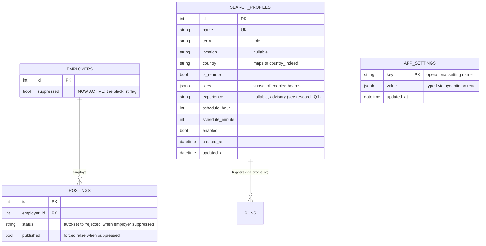

# Data Model: Operator Self-Service

**Feature**: `001-ui-self-service` | **Date**: 21 July 2026

Two new entities; no new columns on existing tables. The blacklist reuses
`employers.suppressed`.

---

## Entity–relationship (new and touched)

> `RUNS` gains an optional `profile_id` so a run is attributable to the profile
> that triggered it (nullable for manual `run-all`). This is the only change to an
> existing table, and it is additive/nullable.

---

## New entities

### `search_profiles`

Supersedes the `SEARCHES` environment list (ADR-0005). One row per saved
job-survey definition.

| Column | Type | Notes |
|---|---|---|
| `id` | int PK | |
| `name` | string, unique | Operator-facing label |
| `term` | string | The role/search term |
| `location` | string, nullable | Board location string |
| `country` | string | Maps to JobSpy `country_indeed` |
| `is_remote` | bool | |
| `sites` | jsonb | Subset of working boards (`["indeed","linkedin"]`) |
| `experience` | string, nullable | Advisory until Q1 resolved; feeds scoring prompt |
| `schedule_hour` | int | 0–23 |
| `schedule_minute` | int | 0–59 |
| `enabled` | bool | Disabled profiles are retained but not scheduled |
| `created_at` / `updated_at` | datetime | |

**Validation**: `sites` non-empty and a subset of working boards; `schedule_hour`
0–23; `schedule_minute` 0–59; `name` unique and non-blank.

**Seeding**: on first migration, the current `SEARCHES` env value is inserted as
one or more profiles so behaviour is unchanged.

### `app_settings`

Runtime-editable operational configuration. Key–value, typed on read through the
existing pydantic `Settings`.

| Column | Type | Notes |
|---|---|---|
| `key` | string PK | Setting name (matches a `Settings` field) |
| `value` | jsonb | Stored as JSON; validated/coerced on read |
| `updated_at` | datetime | |

**Editable keys** (research Q2): `results_per_search`, `hours_old`,
`request_delay_seconds`, `publish_threshold`, `scoring_model`,
`linkedin_fetch_description`, `title_include_pattern`, `title_exclude_pattern`,
`proxies`.

**Excluded**: `database_url` (infrastructure), `web_host`/`web_port`/`timezone`
(restart-affecting; shown read-only), any future secret.

**Resolution order** (read): `app_settings.value` → environment/`.env` default →
code default. Implemented as an accessor over the existing `Settings` singleton so
call sites keep reading `settings.<name>`-style values through the store.

---

## Changed usage of existing entities

> **Superseded by [ADR-0015](../../Docs/ADRs/0015-employer-level-suppression.md)
> / [002-employer-suppression-derived/data-model.md](../002-employer-suppression-derived/data-model.md).**
> This section introduced the materialised suppression copy — a posting sweep
> that stamped `employers.suppressed` onto `postings.status` — without an ADR
> recording the decision. ADR-0015 reverses it: `employers.suppressed` is the
> only place blacklist state lives, and `postings.status`/`published` are
> derived from it at read time, never written to. Left here, unedited, as the
> record of what was originally decided and why it changed.

### `employers.suppressed` — the blacklist

- **Before**: column exists, read nowhere.
- **After**: set/unset via the blacklist UI; read by the suppression pass and by
  publication (a suppressed employer's postings are never published, FR-009).
- **Index**: add a partial index `WHERE suppressed = true` for the suppression
  query.

### `postings.status` / `postings.published`

- The suppression pass sets `status = 'rejected'`, `published = false` for postings
  of suppressed employers. No schema change. `rejected` already carries the
  "never resurfaces" guarantee (D9).

### `runs.profile_id` (new, nullable)

- Attributes a run to the profile that triggered it; null for manual `run-all`.
  Additive and nullable — safe migration on populated tables.

---

## Migrations

| # | Change | Backfill / safety |
|---|---|---|
| 1 | Create `search_profiles`; seed from `SEARCHES` env | Seed preserves current behaviour |
| 2 | Create `app_settings` | Empty; env defaults apply until a key is set |
| 3 | Add `runs.profile_id` (nullable FK) | Nullable; no backfill needed |
| 4 | Partial index on `employers(suppressed) WHERE suppressed` | Index only |

All migrations are additive. No column is dropped; no existing data is rewritten
except the optional seed of profiles.
